Importação das bibliotecas


```python
import os
import numpy as np
import pandas as pd 
import matplotlib.pyplot as plt
import seaborn as sns
from scipy.stats import chi2_contingency
#from fancyimpute import KNN 
import os
import statistics
from sklearn.metrics import r2_score
from scipy import stats
from sklearn.model_selection import train_test_split,RandomizedSearchCV,KFold, cross_val_score,cross_val_predict,GridSearchCV

from sklearn.naive_bayes import GaussianNB
from sklearn.neighbors import KNeighborsClassifier
from sklearn.linear_model import LogisticRegression
from sklearn.ensemble import RandomForestClassifier
from sklearn.tree import DecisionTreeClassifier
from sklearn.metrics import mean_squared_error
from sklearn.ensemble import RandomForestClassifier
from sklearn.linear_model import LinearRegression
from sklearn.ensemble import GradientBoostingRegressor
from sklearn.svm import SVC

from sklearn.metrics import classification_report,confusion_matrix
from sklearn.metrics import roc_curve,auc,roc_auc_score

from sklearn import metrics

%matplotlib inline
sns.set_style('whitegrid')
import warnings
warnings.filterwarnings('ignore')
```

Importação do ficheiro excel


```python
# nao apagar esta linha, para fazerem a imprtação de ficheiros a partir da vossa maquina, pfv comentem a linha abaixo e criem uma nova com o path
#data= pd.read_csv("C:\\Users\\omeut\\Downloads\\TrabalhoFinal\\EmployeeAbsenteeism\\train_data.csv")
#data = pd.read_csv("C:\\Users\\Telmo\\Documents\\GitHub\\EmployeeAbsenteeism\\train_data.csv")
#data_test = pd.read_csv("C:\\Users\\Telmo\\Documents\\GitHub\\EmployeeAbsenteeism\\test_data.csv")
data = pd.read_csv("./train_data.csv")
data_test = pd.read_csv("./test_data.csv")
data = pd.DataFrame(data)
data_test = pd.DataFrame(data_test)
print(data)
```

          ID  Reason for absence  Month of absence  Day of the week  Seasons  \
    0      1                  26                 7                3        1   
    1      2                   0                 7                3        1   
    2      3                  23                 7                4        1   
    3      4                   7                 7                5        1   
    4      5                  23                 7                5        1   
    5      6                  23                 7                6        1   
    6      7                  22                 7                6        1   
    7      8                  23                 7                6        1   
    8      9                  19                 7                2        1   
    9     10                  22                 7                2        1   
    10    11                   1                 7                2        1   
    11    12                   1                 7                3        1   
    12    13                  11                 7                4        1   
    13    14                  11                 7                4        1   
    14    15                  23                 7                4        1   
    15    16                  14                 7                6        1   
    16    17                  23                 7                6        1   
    17    18                  21                 7                2        1   
    18    19                  11                 7                5        1   
    19    20                  23                 8                4        1   
    20    21                  10                 8                4        1   
    21    22                  11                 8                2        1   
    22    23                  13                 8                2        1   
    23    24                  28                 8                6        1   
    24    25                  18                 8                2        1   
    25    26                  25                 8                2        1   
    26    27                  23                 8                3        1   
    27    28                  28                 8                4        1   
    28    29                  18                 8                4        1   
    29    30                  23                 8                6        1   
    ..   ...                 ...               ...              ...      ...   
    470  471                  28                 7                3        1   
    471  472                   9                 7                3        1   
    472  473                  28                 7                3        1   
    473  474                  23                 7                6        1   
    474  475                  22                 7                6        1   
    475  476                  22                 7                2        1   
    476  477                  26                 7                2        1   
    477  478                  28                 7                3        1   
    478  479                  28                 7                5        1   
    479  480                  23                 7                5        1   
    480  481                  25                 8                5        1   
    481  482                  25                 8                2        1   
    482  483                  28                 8                3        1   
    483  484                  28                 8                3        1   
    484  485                  26                 8                3        1   
    485  486                  26                 8                3        1   
    486  487                  28                 8                5        1   
    487  488                  25                 8                2        1   
    488  489                  25                 8                3        1   
    489  490                  23                 8                5        1   
    490  491                  23                 8                3        1   
    491  492                  28                 8                3        1   
    492  493                  28                 8                3        1   
    493  494                  28                 8                5        1   
    494  495                  28                 8                2        1   
    495  496                  28                 9                3        1   
    496  497                  28                 9                3        1   
    497  498                  28                 9                3        1   
    498  499                  23                 9                3        1   
    499  500                  28                 9                5        1   
    
         Transportation expense  Distance from Residence to Work  Service time  \
    0                       289                               36            13   
    1                       118                               13            18   
    2                       179                               51            18   
    3                       279                                5            14   
    4                       289                               36            13   
    5                       179                               51            18   
    6                       361                               52             3   
    7                       260                               50            11   
    8                       155                               12            14   
    9                       235                               11            14   
    10                      260                               50            11   
    11                      260                               50            11   
    12                      260                               50            11   
    13                      179                               51            18   
    14                      179                               51            18   
    15                      246                               25            16   
    16                      179                               51            18   
    17                      179                               51            18   
    18                      189                               29            13   
    19                      248                               25            14   
    20                      330                               16             4   
    21                      179                               51            18   
    22                      361                               52             3   
    23                      260                               50            11   
    24                      289                               36            13   
    25                      361                               52             3   
    26                      289                               36            13   
    27                      157                               27             6   
    28                      289                               36            13   
    29                      179                               51            18   
    ..                      ...                              ...           ...   
    470                     246                               25            16   
    471                     225                               26             9   
    472                     179                               51            18   
    473                     118                               13            18   
    474                     361                               52             3   
    475                     289                               36            13   
    476                     235                               20            13   
    477                     246                               25            16   
    478                     291                               31            12   
    479                     279                                5            14   
    480                     179                               51            18   
    481                     179                               22            17   
    482                     246                               25            16   
    483                     118                               10            10   
    484                     289                               36            13   
    485                     235                               20            13   
    486                     291                               31            12   
    487                     179                               51            18   
    488                     179                               22            17   
    489                     330                               16             4   
    490                     235                               11            14   
    491                     246                               25            16   
    492                     118                               10            10   
    493                     291                               31            12   
    494                     260                               50            11   
    495                     246                               25            16   
    496                     246                               25            16   
    497                     118                               10            10   
    498                     155                               12            14   
    499                     291                               31            12   
    
         Age Work load Average/day   ...  Disciplinary failure  Education  Son  \
    0     33                239,554  ...                     0          1    2   
    1     50                239,554  ...                     1          1    1   
    2     38                239,554  ...                     0          1    0   
    3     39                239,554  ...                     0          1    2   
    4     33                239,554  ...                     0          1    2   
    5     38                239,554  ...                     0          1    0   
    6     28                239,554  ...                     0          1    1   
    7     36                239,554  ...                     0          1    4   
    8     34                239,554  ...                     0          1    2   
    9     37                239,554  ...                     0          3    1   
    10    36                239,554  ...                     0          1    4   
    11    36                239,554  ...                     0          1    4   
    12    36                239,554  ...                     0          1    4   
    13    38                239,554  ...                     0          1    0   
    14    38                239,554  ...                     0          1    0   
    15    41                239,554  ...                     0          1    0   
    16    38                239,554  ...                     0          1    0   
    17    38                239,554  ...                     0          1    0   
    18    33                239,554  ...                     0          1    2   
    19    47                205,917  ...                     0          1    2   
    20    28                205,917  ...                     0          2    0   
    21    38                205,917  ...                     0          1    0   
    22    28                205,917  ...                     0          1    1   
    23    36                205,917  ...                     0          1    4   
    24    33                205,917  ...                     0          1    2   
    25    28                205,917  ...                     0          1    1   
    26    33                205,917  ...                     0          1    2   
    27    29                205,917  ...                     0          1    0   
    28    33                205,917  ...                     0          1    2   
    29    38                205,917  ...                     0          1    0   
    ..   ...                    ...  ...                   ...        ...  ...   
    470   41                230,290  ...                     0          1    0   
    471   28                230,290  ...                     0          1    1   
    472   38                230,290  ...                     0          1    0   
    473   50                230,290  ...                     0          1    1   
    474   28                230,290  ...                     0          1    1   
    475   33                230,290  ...                     0          1    2   
    476   43                230,290  ...                     0          1    1   
    477   41                230,290  ...                     0          1    0   
    478   40                230,290  ...                     0          1    1   
    479   39                230,290  ...                     0          1    2   
    480   38                249,797  ...                     0          1    0   
    481   40                249,797  ...                     0          2    2   
    482   41                249,797  ...                     0          1    0   
    483   37                249,797  ...                     0          1    0   
    484   33                249,797  ...                     0          1    2   
    485   43                249,797  ...                     0          1    1   
    486   40                249,797  ...                     0          1    1   
    487   38                249,797  ...                     0          1    0   
    488   40                249,797  ...                     0          2    2   
    489   28                249,797  ...                     0          2    0   
    490   37                249,797  ...                     0          3    1   
    491   41                249,797  ...                     0          1    0   
    492   37                249,797  ...                     0          1    0   
    493   40                249,797  ...                     0          1    1   
    494   36                249,797  ...                     0          1    4   
    495   41                261,756  ...                     0          1    0   
    496   41                261,756  ...                     0          1    0   
    497   37                261,756  ...                     0          1    0   
    498   34                261,756  ...                     0          1    2   
    499   40                261,756  ...                     0          1    1   
    
         Social drinker  Social smoker  Pet  Weight  Height  Body mass index  \
    0                 1              0    1      90     172               30   
    1                 1              0    0      98     178               31   
    2                 1              0    0      89     170               31   
    3                 1              1    0      68     168               24   
    4                 1              0    1      90     172               30   
    5                 1              0    0      89     170               31   
    6                 1              0    4      80     172               27   
    7                 1              0    0      65     168               23   
    8                 1              0    0      95     196               25   
    9                 0              0    1      88     172               29   
    10                1              0    0      65     168               23   
    11                1              0    0      65     168               23   
    12                1              0    0      65     168               23   
    13                1              0    0      89     170               31   
    14                1              0    0      89     170               31   
    15                1              0    0      67     170               23   
    16                1              0    0      89     170               31   
    17                1              0    0      89     170               31   
    18                0              0    2      69     167               25   
    19                0              0    1      86     165               32   
    20                0              0    0      84     182               25   
    21                1              0    0      89     170               31   
    22                1              0    4      80     172               27   
    23                1              0    0      65     168               23   
    24                1              0    1      90     172               30   
    25                1              0    4      80     172               27   
    26                1              0    1      90     172               30   
    27                1              1    0      75     185               22   
    28                1              0    1      90     172               30   
    29                1              0    0      89     170               31   
    ..              ...            ...  ...     ...     ...              ...   
    470               1              0    0      67     170               23   
    471               0              0    2      69     169               24   
    472               1              0    0      89     170               31   
    473               1              0    0      98     178               31   
    474               1              0    4      80     172               27   
    475               1              0    1      90     172               30   
    476               1              0    0     106     167               38   
    477               1              0    0      67     170               23   
    478               1              0    1      73     171               25   
    479               1              1    0      68     168               24   
    480               1              0    0      89     170               31   
    481               0              1    0      63     170               22   
    482               1              0    0      67     170               23   
    483               0              0    0      83     172               28   
    484               1              0    1      90     172               30   
    485               1              0    0     106     167               38   
    486               1              0    1      73     171               25   
    487               1              0    0      89     170               31   
    488               0              1    0      63     170               22   
    489               0              0    0      84     182               25   
    490               0              0    1      88     172               29   
    491               1              0    0      67     170               23   
    492               0              0    0      83     172               28   
    493               1              0    1      73     171               25   
    494               1              0    0      65     168               23   
    495               1              0    0      67     170               23   
    496               1              0    0      67     170               23   
    497               0              0    0      83     172               28   
    498               1              0    0      95     196               25   
    499               1              0    1      73     171               25   
    
         Absent  
    0         1  
    1         0  
    2         1  
    3         1  
    4         1  
    5         1  
    6         1  
    7         1  
    8         1  
    9         1  
    10        1  
    11        1  
    12        1  
    13        0  
    14        1  
    15        1  
    16        1  
    17        1  
    18        1  
    19        1  
    20        1  
    21        0  
    22        1  
    23        1  
    24        1  
    25        1  
    26        0  
    27        1  
    28        1  
    29        1  
    ..      ...  
    470       1  
    471       1  
    472       0  
    473       0  
    474       1  
    475       1  
    476       1  
    477       1  
    478       0  
    479       1  
    480       1  
    481       0  
    482       1  
    483       1  
    484       1  
    485       1  
    486       1  
    487       1  
    488       1  
    489       1  
    490       1  
    491       0  
    492       1  
    493       1  
    494       1  
    495       0  
    496       0  
    497       1  
    498       1  
    499       1  
    
    [500 rows x 21 columns]
    

(Numero de linhas, numero de colunas)


```python
data.shape
```


    (500, 21)


```python
data['Disciplinary failure'].unique()
```


    array([0, 1], dtype=int64)


Colunas do dataSet


```python
data.columns
```


    Index(['ID', 'Reason for absence', 'Month of absence', 'Day of the week',
           'Seasons', 'Transportation expense', 'Distance from Residence to Work',
           'Service time', 'Age', 'Work load Average/day ', 'Hit target',
           'Disciplinary failure', 'Education', 'Son', 'Social drinker',
           'Social smoker', 'Pet', 'Weight', 'Height', 'Body mass index',
           'Absent'],
          dtype='object')


Tipos de dados


```python
data.info()
```

    <class 'pandas.core.frame.DataFrame'>
    RangeIndex: 500 entries, 0 to 499
    Data columns (total 21 columns):
    ID                                 500 non-null int64
    Reason for absence                 500 non-null int64
    Month of absence                   500 non-null int64
    Day of the week                    500 non-null int64
    Seasons                            500 non-null int64
    Transportation expense             500 non-null int64
    Distance from Residence to Work    500 non-null int64
    Service time                       500 non-null int64
    Age                                500 non-null int64
    Work load Average/day              500 non-null object
    Hit target                         500 non-null int64
    Disciplinary failure               500 non-null int64
    Education                          500 non-null int64
    Son                                500 non-null int64
    Social drinker                     500 non-null int64
    Social smoker                      500 non-null int64
    Pet                                500 non-null int64
    Weight                             500 non-null int64
    Height                             500 non-null int64
    Body mass index                    500 non-null int64
    Absent                             500 non-null int64
    dtypes: int64(20), object(1)
    memory usage: 82.1+ KB
    


```python
data.describe()
```


<div>
<style scoped>
    .dataframe tbody tr th:only-of-type {
        vertical-align: middle;
    }

    .dataframe tbody tr th {
        vertical-align: top;
    }

    .dataframe thead th {
        text-align: right;
    }
</style>
<table border="1" class="dataframe">
  <thead>
    <tr style="text-align: right;">
      <th></th>
      <th>ID</th>
      <th>Reason for absence</th>
      <th>Month of absence</th>
      <th>Day of the week</th>
      <th>Seasons</th>
      <th>Transportation expense</th>
      <th>Distance from Residence to Work</th>
      <th>Service time</th>
      <th>Age</th>
      <th>Hit target</th>
      <th>Disciplinary failure</th>
      <th>Education</th>
      <th>Son</th>
      <th>Social drinker</th>
      <th>Social smoker</th>
      <th>Pet</th>
      <th>Weight</th>
      <th>Height</th>
      <th>Body mass index</th>
      <th>Absent</th>
    </tr>
  </thead>
  <tbody>
    <tr>
      <th>count</th>
      <td>500.000000</td>
      <td>500.000000</td>
      <td>500.000000</td>
      <td>500.00000</td>
      <td>500.000000</td>
      <td>500.000000</td>
      <td>500.000000</td>
      <td>500.000000</td>
      <td>500.000000</td>
      <td>500.000000</td>
      <td>500.000000</td>
      <td>500.000000</td>
      <td>500.000000</td>
      <td>500.000000</td>
      <td>500.000000</td>
      <td>500.000000</td>
      <td>500.000000</td>
      <td>500.000000</td>
      <td>500.000000</td>
      <td>500.000000</td>
    </tr>
    <tr>
      <th>mean</th>
      <td>250.500000</td>
      <td>19.288000</td>
      <td>6.614000</td>
      <td>3.88000</td>
      <td>2.450000</td>
      <td>223.640000</td>
      <td>29.978000</td>
      <td>12.650000</td>
      <td>36.660000</td>
      <td>94.168000</td>
      <td>0.064000</td>
      <td>1.204000</td>
      <td>1.086000</td>
      <td>0.620000</td>
      <td>0.076000</td>
      <td>0.628000</td>
      <td>79.698000</td>
      <td>172.098000</td>
      <td>26.870000</td>
      <td>0.790000</td>
    </tr>
    <tr>
      <th>std</th>
      <td>144.481833</td>
      <td>8.543245</td>
      <td>3.343555</td>
      <td>1.43587</td>
      <td>1.165425</td>
      <td>67.323155</td>
      <td>15.068498</td>
      <td>4.036345</td>
      <td>6.137731</td>
      <td>3.912338</td>
      <td>0.244998</td>
      <td>0.561261</td>
      <td>1.178721</td>
      <td>0.485873</td>
      <td>0.265264</td>
      <td>1.071406</td>
      <td>12.605101</td>
      <td>6.234913</td>
      <td>4.151092</td>
      <td>0.407716</td>
    </tr>
    <tr>
      <th>min</th>
      <td>1.000000</td>
      <td>0.000000</td>
      <td>1.000000</td>
      <td>2.00000</td>
      <td>1.000000</td>
      <td>118.000000</td>
      <td>5.000000</td>
      <td>3.000000</td>
      <td>27.000000</td>
      <td>81.000000</td>
      <td>0.000000</td>
      <td>1.000000</td>
      <td>0.000000</td>
      <td>0.000000</td>
      <td>0.000000</td>
      <td>0.000000</td>
      <td>56.000000</td>
      <td>163.000000</td>
      <td>19.000000</td>
      <td>0.000000</td>
    </tr>
    <tr>
      <th>25%</th>
      <td>125.750000</td>
      <td>13.000000</td>
      <td>3.750000</td>
      <td>3.00000</td>
      <td>1.000000</td>
      <td>179.000000</td>
      <td>16.000000</td>
      <td>10.000000</td>
      <td>33.000000</td>
      <td>92.000000</td>
      <td>0.000000</td>
      <td>1.000000</td>
      <td>0.000000</td>
      <td>0.000000</td>
      <td>0.000000</td>
      <td>0.000000</td>
      <td>69.000000</td>
      <td>169.000000</td>
      <td>24.000000</td>
      <td>1.000000</td>
    </tr>
    <tr>
      <th>50%</th>
      <td>250.500000</td>
      <td>23.000000</td>
      <td>7.000000</td>
      <td>4.00000</td>
      <td>2.000000</td>
      <td>225.000000</td>
      <td>26.000000</td>
      <td>13.000000</td>
      <td>37.000000</td>
      <td>95.000000</td>
      <td>0.000000</td>
      <td>1.000000</td>
      <td>1.000000</td>
      <td>1.000000</td>
      <td>0.000000</td>
      <td>0.000000</td>
      <td>83.000000</td>
      <td>170.000000</td>
      <td>25.000000</td>
      <td>1.000000</td>
    </tr>
    <tr>
      <th>75%</th>
      <td>375.250000</td>
      <td>26.000000</td>
      <td>9.000000</td>
      <td>5.00000</td>
      <td>4.000000</td>
      <td>260.000000</td>
      <td>50.000000</td>
      <td>16.000000</td>
      <td>40.000000</td>
      <td>97.000000</td>
      <td>0.000000</td>
      <td>1.000000</td>
      <td>2.000000</td>
      <td>1.000000</td>
      <td>0.000000</td>
      <td>1.000000</td>
      <td>89.000000</td>
      <td>172.000000</td>
      <td>31.000000</td>
      <td>1.000000</td>
    </tr>
    <tr>
      <th>max</th>
      <td>500.000000</td>
      <td>28.000000</td>
      <td>12.000000</td>
      <td>6.00000</td>
      <td>4.000000</td>
      <td>388.000000</td>
      <td>52.000000</td>
      <td>29.000000</td>
      <td>58.000000</td>
      <td>100.000000</td>
      <td>1.000000</td>
      <td>3.000000</td>
      <td>4.000000</td>
      <td>1.000000</td>
      <td>1.000000</td>
      <td>5.000000</td>
      <td>108.000000</td>
      <td>196.000000</td>
      <td>38.000000</td>
      <td>1.000000</td>
    </tr>
  </tbody>
</table>
</div>


Como o mínimo para o Reason for absence é 0 e não temos nunhem significado para 0 entao vamos remover todas as linhas que o reason for absensce for 0


```python
#vamos experimentar sem ignorar estes dados
#data = data.drop(data[data['Reason for absence']==0].index)
#data_test = data_test.drop(data[data['Reason for absence']==0].index)
```


```python
data = data.drop(['Weight', 'Height','ID'], 1)
data_test = data_test.drop(['Weight', 'Height','ID'], 1)
```


```python
data_test.head()
```


<div>
<style scoped>
    .dataframe tbody tr th:only-of-type {
        vertical-align: middle;
    }

    .dataframe tbody tr th {
        vertical-align: top;
    }

    .dataframe thead th {
        text-align: right;
    }
</style>
<table border="1" class="dataframe">
  <thead>
    <tr style="text-align: right;">
      <th></th>
      <th>Reason for absence</th>
      <th>Month of absence</th>
      <th>Day of the week</th>
      <th>Seasons</th>
      <th>Transportation expense</th>
      <th>Distance from Residence to Work</th>
      <th>Service time</th>
      <th>Age</th>
      <th>Work load Average/day</th>
      <th>Hit target</th>
      <th>Disciplinary failure</th>
      <th>Education</th>
      <th>Son</th>
      <th>Social drinker</th>
      <th>Social smoker</th>
      <th>Pet</th>
      <th>Body mass index</th>
    </tr>
  </thead>
  <tbody>
    <tr>
      <th>0</th>
      <td>23</td>
      <td>9</td>
      <td>6</td>
      <td>1</td>
      <td>179</td>
      <td>26</td>
      <td>9</td>
      <td>30</td>
      <td>261756</td>
      <td>87</td>
      <td>0</td>
      <td>3</td>
      <td>0</td>
      <td>0</td>
      <td>0</td>
      <td>0</td>
      <td>19</td>
    </tr>
    <tr>
      <th>1</th>
      <td>23</td>
      <td>9</td>
      <td>6</td>
      <td>1</td>
      <td>248</td>
      <td>25</td>
      <td>14</td>
      <td>47</td>
      <td>261756</td>
      <td>87</td>
      <td>0</td>
      <td>1</td>
      <td>2</td>
      <td>0</td>
      <td>0</td>
      <td>1</td>
      <td>32</td>
    </tr>
    <tr>
      <th>2</th>
      <td>23</td>
      <td>9</td>
      <td>2</td>
      <td>1</td>
      <td>179</td>
      <td>51</td>
      <td>18</td>
      <td>38</td>
      <td>261756</td>
      <td>87</td>
      <td>0</td>
      <td>1</td>
      <td>0</td>
      <td>1</td>
      <td>0</td>
      <td>0</td>
      <td>31</td>
    </tr>
    <tr>
      <th>3</th>
      <td>23</td>
      <td>9</td>
      <td>4</td>
      <td>1</td>
      <td>225</td>
      <td>26</td>
      <td>9</td>
      <td>28</td>
      <td>261756</td>
      <td>87</td>
      <td>0</td>
      <td>1</td>
      <td>1</td>
      <td>0</td>
      <td>0</td>
      <td>2</td>
      <td>24</td>
    </tr>
    <tr>
      <th>4</th>
      <td>23</td>
      <td>9</td>
      <td>2</td>
      <td>1</td>
      <td>179</td>
      <td>26</td>
      <td>9</td>
      <td>30</td>
      <td>261756</td>
      <td>87</td>
      <td>0</td>
      <td>3</td>
      <td>0</td>
      <td>0</td>
      <td>0</td>
      <td>0</td>
      <td>19</td>
    </tr>
  </tbody>
</table>
</div>


```python
data.describe()
```


<div>
<style scoped>
    .dataframe tbody tr th:only-of-type {
        vertical-align: middle;
    }

    .dataframe tbody tr th {
        vertical-align: top;
    }

    .dataframe thead th {
        text-align: right;
    }
</style>
<table border="1" class="dataframe">
  <thead>
    <tr style="text-align: right;">
      <th></th>
      <th>Reason for absence</th>
      <th>Month of absence</th>
      <th>Day of the week</th>
      <th>Seasons</th>
      <th>Transportation expense</th>
      <th>Distance from Residence to Work</th>
      <th>Service time</th>
      <th>Age</th>
      <th>Hit target</th>
      <th>Disciplinary failure</th>
      <th>Education</th>
      <th>Son</th>
      <th>Social drinker</th>
      <th>Social smoker</th>
      <th>Pet</th>
      <th>Body mass index</th>
      <th>Absent</th>
    </tr>
  </thead>
  <tbody>
    <tr>
      <th>count</th>
      <td>500.000000</td>
      <td>500.000000</td>
      <td>500.00000</td>
      <td>500.000000</td>
      <td>500.000000</td>
      <td>500.000000</td>
      <td>500.000000</td>
      <td>500.000000</td>
      <td>500.000000</td>
      <td>500.000000</td>
      <td>500.000000</td>
      <td>500.000000</td>
      <td>500.000000</td>
      <td>500.000000</td>
      <td>500.000000</td>
      <td>500.000000</td>
      <td>500.000000</td>
    </tr>
    <tr>
      <th>mean</th>
      <td>19.288000</td>
      <td>6.614000</td>
      <td>3.88000</td>
      <td>2.450000</td>
      <td>223.640000</td>
      <td>29.978000</td>
      <td>12.650000</td>
      <td>36.660000</td>
      <td>94.168000</td>
      <td>0.064000</td>
      <td>1.204000</td>
      <td>1.086000</td>
      <td>0.620000</td>
      <td>0.076000</td>
      <td>0.628000</td>
      <td>26.870000</td>
      <td>0.790000</td>
    </tr>
    <tr>
      <th>std</th>
      <td>8.543245</td>
      <td>3.343555</td>
      <td>1.43587</td>
      <td>1.165425</td>
      <td>67.323155</td>
      <td>15.068498</td>
      <td>4.036345</td>
      <td>6.137731</td>
      <td>3.912338</td>
      <td>0.244998</td>
      <td>0.561261</td>
      <td>1.178721</td>
      <td>0.485873</td>
      <td>0.265264</td>
      <td>1.071406</td>
      <td>4.151092</td>
      <td>0.407716</td>
    </tr>
    <tr>
      <th>min</th>
      <td>0.000000</td>
      <td>1.000000</td>
      <td>2.00000</td>
      <td>1.000000</td>
      <td>118.000000</td>
      <td>5.000000</td>
      <td>3.000000</td>
      <td>27.000000</td>
      <td>81.000000</td>
      <td>0.000000</td>
      <td>1.000000</td>
      <td>0.000000</td>
      <td>0.000000</td>
      <td>0.000000</td>
      <td>0.000000</td>
      <td>19.000000</td>
      <td>0.000000</td>
    </tr>
    <tr>
      <th>25%</th>
      <td>13.000000</td>
      <td>3.750000</td>
      <td>3.00000</td>
      <td>1.000000</td>
      <td>179.000000</td>
      <td>16.000000</td>
      <td>10.000000</td>
      <td>33.000000</td>
      <td>92.000000</td>
      <td>0.000000</td>
      <td>1.000000</td>
      <td>0.000000</td>
      <td>0.000000</td>
      <td>0.000000</td>
      <td>0.000000</td>
      <td>24.000000</td>
      <td>1.000000</td>
    </tr>
    <tr>
      <th>50%</th>
      <td>23.000000</td>
      <td>7.000000</td>
      <td>4.00000</td>
      <td>2.000000</td>
      <td>225.000000</td>
      <td>26.000000</td>
      <td>13.000000</td>
      <td>37.000000</td>
      <td>95.000000</td>
      <td>0.000000</td>
      <td>1.000000</td>
      <td>1.000000</td>
      <td>1.000000</td>
      <td>0.000000</td>
      <td>0.000000</td>
      <td>25.000000</td>
      <td>1.000000</td>
    </tr>
    <tr>
      <th>75%</th>
      <td>26.000000</td>
      <td>9.000000</td>
      <td>5.00000</td>
      <td>4.000000</td>
      <td>260.000000</td>
      <td>50.000000</td>
      <td>16.000000</td>
      <td>40.000000</td>
      <td>97.000000</td>
      <td>0.000000</td>
      <td>1.000000</td>
      <td>2.000000</td>
      <td>1.000000</td>
      <td>0.000000</td>
      <td>1.000000</td>
      <td>31.000000</td>
      <td>1.000000</td>
    </tr>
    <tr>
      <th>max</th>
      <td>28.000000</td>
      <td>12.000000</td>
      <td>6.00000</td>
      <td>4.000000</td>
      <td>388.000000</td>
      <td>52.000000</td>
      <td>29.000000</td>
      <td>58.000000</td>
      <td>100.000000</td>
      <td>1.000000</td>
      <td>3.000000</td>
      <td>4.000000</td>
      <td>1.000000</td>
      <td>1.000000</td>
      <td>5.000000</td>
      <td>38.000000</td>
      <td>1.000000</td>
    </tr>
  </tbody>
</table>
</div>


Calculo de numero de dados unicos


```python
data.nunique()
```


    Reason for absence                 26
    Month of absence                   12
    Day of the week                     5
    Seasons                             4
    Transportation expense             23
    Distance from Residence to Work    24
    Service time                       15
    Age                                20
    Work load Average/day              27
    Hit target                         12
    Disciplinary failure                2
    Education                           3
    Son                                 5
    Social drinker                      2
    Social smoker                       2
    Pet                                 5
    Body mass index                    16
    Absent                              2
    dtype: int64


Renomeamos as a coluna para retirar a barra do nome


```python
data_test.columns
```


    Index(['Reason for absence', 'Month of absence', 'Day of the week', 'Seasons',
           'Transportation expense', 'Distance from Residence to Work',
           'Service time', 'Age', 'Work load Average/day ', 'Hit target',
           'Disciplinary failure', 'Education', 'Son', 'Social drinker',
           'Social smoker', 'Pet', 'Body mass index'],
          dtype='object')


```python
data.columns = data.columns.str.replace("Work load Average/day ", "Work load Average per day")
data_test.columns = data_test.columns.str.replace("Work load Average/day ", "Work load Average per day")

```


```python
data["Work load Average per day"]=data["Work load Average per day"].str.replace(",","").astype(float)
```


```python
data["Work load Average per day"].astype(int)
data_test["Work load Average per day"].astype(int)
```


    0      261756
    1      261756
    2      261756
    3      261756
    4      261756
    5      261756
    6      261756
    7      284853
    8      284853
    9      284853
    10     284853
    11     284853
    12     284853
    13     284853
    14     284853
    15     284853
    16     284853
    17     284853
    18     284853
    19     284853
    20     284853
    21     284853
    22     284853
    23     284853
    24     284853
    25     284853
    26     284853
    27     284853
    28     284853
    29     284853
            ...  
    210    275089
    211    275089
    212    275089
    213    275089
    214    275089
    215    275089
    216    275089
    217    275089
    218    275089
    219    275089
    220    275089
    221    275089
    222    275089
    223    275089
    224    275089
    225    264604
    226    264604
    227    264604
    228    264604
    229    264604
    230    264604
    231    264604
    232    264604
    233    264604
    234    264604
    235    264604
    236    264604
    237    271219
    238    271219
    239    271219
    Name: Work load Average per day, Length: 240, dtype: int32


```python
data.describe()
```


<div>
<style scoped>
    .dataframe tbody tr th:only-of-type {
        vertical-align: middle;
    }

    .dataframe tbody tr th {
        vertical-align: top;
    }

    .dataframe thead th {
        text-align: right;
    }
</style>
<table border="1" class="dataframe">
  <thead>
    <tr style="text-align: right;">
      <th></th>
      <th>Reason for absence</th>
      <th>Month of absence</th>
      <th>Day of the week</th>
      <th>Seasons</th>
      <th>Transportation expense</th>
      <th>Distance from Residence to Work</th>
      <th>Service time</th>
      <th>Age</th>
      <th>Work load Average per day</th>
      <th>Hit target</th>
      <th>Disciplinary failure</th>
      <th>Education</th>
      <th>Son</th>
      <th>Social drinker</th>
      <th>Social smoker</th>
      <th>Pet</th>
      <th>Body mass index</th>
      <th>Absent</th>
    </tr>
  </thead>
  <tbody>
    <tr>
      <th>count</th>
      <td>500.000000</td>
      <td>500.000000</td>
      <td>500.00000</td>
      <td>500.000000</td>
      <td>500.000000</td>
      <td>500.000000</td>
      <td>500.000000</td>
      <td>500.000000</td>
      <td>500.000000</td>
      <td>500.000000</td>
      <td>500.000000</td>
      <td>500.000000</td>
      <td>500.000000</td>
      <td>500.000000</td>
      <td>500.000000</td>
      <td>500.000000</td>
      <td>500.000000</td>
      <td>500.000000</td>
    </tr>
    <tr>
      <th>mean</th>
      <td>19.288000</td>
      <td>6.614000</td>
      <td>3.88000</td>
      <td>2.450000</td>
      <td>223.640000</td>
      <td>29.978000</td>
      <td>12.650000</td>
      <td>36.660000</td>
      <td>276792.768000</td>
      <td>94.168000</td>
      <td>0.064000</td>
      <td>1.204000</td>
      <td>1.086000</td>
      <td>0.620000</td>
      <td>0.076000</td>
      <td>0.628000</td>
      <td>26.870000</td>
      <td>0.790000</td>
    </tr>
    <tr>
      <th>std</th>
      <td>8.543245</td>
      <td>3.343555</td>
      <td>1.43587</td>
      <td>1.165425</td>
      <td>67.323155</td>
      <td>15.068498</td>
      <td>4.036345</td>
      <td>6.137731</td>
      <td>43422.722869</td>
      <td>3.912338</td>
      <td>0.244998</td>
      <td>0.561261</td>
      <td>1.178721</td>
      <td>0.485873</td>
      <td>0.265264</td>
      <td>1.071406</td>
      <td>4.151092</td>
      <td>0.407716</td>
    </tr>
    <tr>
      <th>min</th>
      <td>0.000000</td>
      <td>1.000000</td>
      <td>2.00000</td>
      <td>1.000000</td>
      <td>118.000000</td>
      <td>5.000000</td>
      <td>3.000000</td>
      <td>27.000000</td>
      <td>205917.000000</td>
      <td>81.000000</td>
      <td>0.000000</td>
      <td>1.000000</td>
      <td>0.000000</td>
      <td>0.000000</td>
      <td>0.000000</td>
      <td>0.000000</td>
      <td>19.000000</td>
      <td>0.000000</td>
    </tr>
    <tr>
      <th>25%</th>
      <td>13.000000</td>
      <td>3.750000</td>
      <td>3.00000</td>
      <td>1.000000</td>
      <td>179.000000</td>
      <td>16.000000</td>
      <td>10.000000</td>
      <td>33.000000</td>
      <td>244387.000000</td>
      <td>92.000000</td>
      <td>0.000000</td>
      <td>1.000000</td>
      <td>0.000000</td>
      <td>0.000000</td>
      <td>0.000000</td>
      <td>0.000000</td>
      <td>24.000000</td>
      <td>1.000000</td>
    </tr>
    <tr>
      <th>50%</th>
      <td>23.000000</td>
      <td>7.000000</td>
      <td>4.00000</td>
      <td>2.000000</td>
      <td>225.000000</td>
      <td>26.000000</td>
      <td>13.000000</td>
      <td>37.000000</td>
      <td>265017.000000</td>
      <td>95.000000</td>
      <td>0.000000</td>
      <td>1.000000</td>
      <td>1.000000</td>
      <td>1.000000</td>
      <td>0.000000</td>
      <td>0.000000</td>
      <td>25.000000</td>
      <td>1.000000</td>
    </tr>
    <tr>
      <th>75%</th>
      <td>26.000000</td>
      <td>9.000000</td>
      <td>5.00000</td>
      <td>4.000000</td>
      <td>260.000000</td>
      <td>50.000000</td>
      <td>16.000000</td>
      <td>40.000000</td>
      <td>306345.000000</td>
      <td>97.000000</td>
      <td>0.000000</td>
      <td>1.000000</td>
      <td>2.000000</td>
      <td>1.000000</td>
      <td>0.000000</td>
      <td>1.000000</td>
      <td>31.000000</td>
      <td>1.000000</td>
    </tr>
    <tr>
      <th>max</th>
      <td>28.000000</td>
      <td>12.000000</td>
      <td>6.00000</td>
      <td>4.000000</td>
      <td>388.000000</td>
      <td>52.000000</td>
      <td>29.000000</td>
      <td>58.000000</td>
      <td>378884.000000</td>
      <td>100.000000</td>
      <td>1.000000</td>
      <td>3.000000</td>
      <td>4.000000</td>
      <td>1.000000</td>
      <td>1.000000</td>
      <td>5.000000</td>
      <td>38.000000</td>
      <td>1.000000</td>
    </tr>
  </tbody>
</table>
</div>


```python
data.columns
```


    Index(['Reason for absence', 'Month of absence', 'Day of the week', 'Seasons',
           'Transportation expense', 'Distance from Residence to Work',
           'Service time', 'Age', 'Work load Average per day', 'Hit target',
           'Disciplinary failure', 'Education', 'Son', 'Social drinker',
           'Social smoker', 'Pet', 'Body mass index', 'Absent'],
          dtype='object')


```python
correlations = data.corr(method='pearson')
sns.set_style('white')
plt.figure(figsize=(10,8))

# Plot heatmap of annotated correlations
sns.heatmap(correlations*100, annot=True, fmt='.0f' )
```


    <matplotlib.axes._subplots.AxesSubplot at 0x1af4e4d6b70>


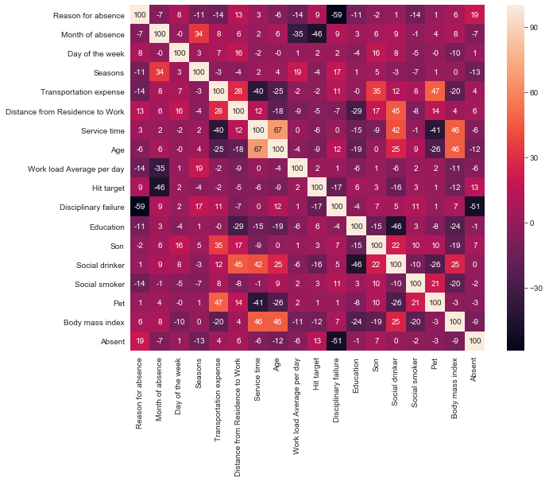


```python
# Variables are " Continuos" and "Categorical"
con = ['Distance from Residence to Work', 'Service time', 'Age', 'Work load Average per day', 'Transportation expense',
       'Hit target','Body mass index']

cat = ['Reason for absence','Month of absence','Day of the week',
                     'Seasons','Disciplinary failure', 'Education', 'Social drinker',
                     'Social smoker', 'Pet', 'Son', 'Absent']
```


```python
#Checking missing values in train dataset
print(data.isnull().sum()) 
#result shows there arent missing values in the dataset
```

    Reason for absence                 0
    Month of absence                   0
    Day of the week                    0
    Seasons                            0
    Transportation expense             0
    Distance from Residence to Work    0
    Service time                       0
    Age                                0
    Work load Average per day          0
    Hit target                         0
    Disciplinary failure               0
    Education                          0
    Son                                0
    Social drinker                     0
    Social smoker                      0
    Pet                                0
    Body mass index                    0
    Absent                             0
    dtype: int64
    

### Visualize data


```python
#Target Variable data distribution
plt.figure(figsize=(8,6))
sns.countplot(x='Absent', data= data)
plt.xlabel('Absent', fontsize= 15)
plt.ylabel('Number of employees', fontsize= 15)
plt.savefig("Absentiseem_Vs_Count.png")
plt.title("Employee Absenteeism Statistics",fontsize= 20)
```


    Text(0.5, 1, 'Employee Absenteeism Statistics')


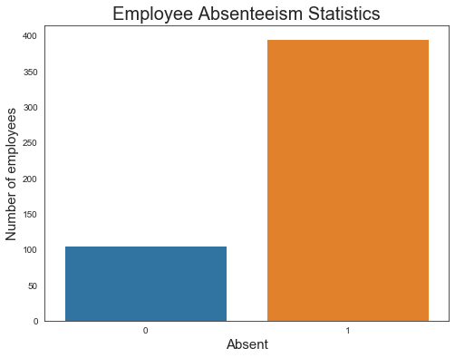


```python
pet_counts=data['Pet'].value_counts().sort_values(ascending=False)
son_counts=data['Son'].value_counts().sort_values(ascending=False)
fig, ax=plt.subplots(1,2,figsize=(16,6))
pet_counts.plot.bar(ax = ax[0],alpha=0.7,color='red' )
ax[0].set_title('Pets distribution across the dataset',weight='bold',fontsize=14) # Give the plot a main title
ax[0].set_xlabel('Pets',weight='bold',fontsize=10) # Set text for the x axis
ax[0].set_ylabel('Pet owner count',weight='bold',fontsize=10)# Set text for y axis

son_counts.plot.bar(ax = ax[1],alpha=0.7,color='red' )
ax[1].set_title('Child distribution across the dataset',weight='bold',fontsize=14) # Give the plot a main title
ax[1].set_xlabel('Children',weight='bold',fontsize=10) # Set text for the x axis
ax[1].set_ylabel('Number of Children',weight='bold',fontsize=10)# Set text for y axis
plt.savefig("Pets_distribution_andChildDist.png")
```


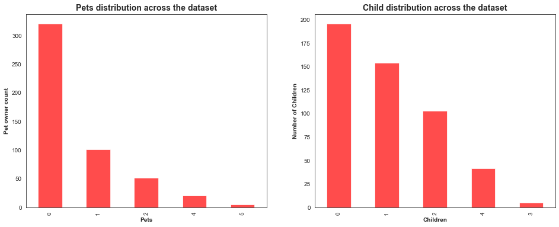


```python
smoke_counts=data['Social smoker'].value_counts().sort_index()
drink_counts=data['Social drinker'].value_counts().sort_index()
fig, ax=plt.subplots(1,2,figsize=(16,6))
smoke_counts.plot.bar(ax = ax[0],alpha=0.6, color=(0.2, 0.7, 0.6, 0.6),width=0.3)
ax[0].set_title('Smokers distribution across the dataset',weight='bold',fontsize=14) # Give the plot a main title
ax[0].set_xlabel('Smoker?',weight='bold',fontsize=10) # Set text for the x axis
ax[0].set_ylabel('Count',weight='bold',fontsize=10)# Set text for y axis
drink_counts.plot.bar(ax = ax[1],alpha=0.6, color=(0.2, 0.4, 0.6, 0.6), width=0.3 )
ax[1].set_title('Drinkers distribution across the dataset',weight='bold',fontsize=14) # Give the plot a main title
ax[1].set_xlabel('Drinker?',weight='bold',fontsize=10) # Set text for the x axis
ax[1].set_ylabel('Count',weight='bold',fontsize=10)# Set text for y axis
plt.savefig("SmokersAndDrinkersDist.png")
```


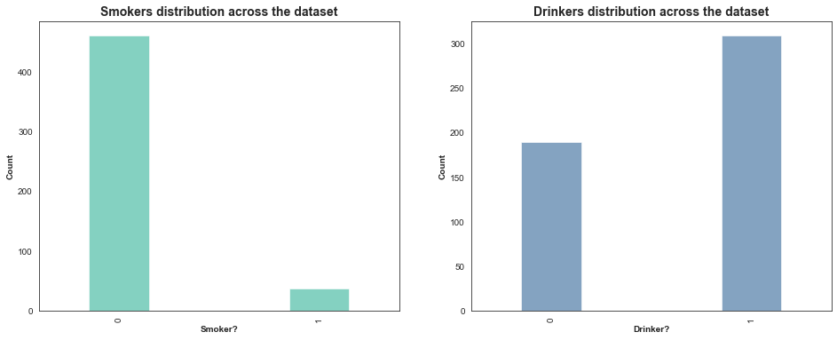


```python
season_counts=data['Seasons'].value_counts().sort_values(ascending=False)
day_counts=data['Day of the week'].value_counts().sort_values(ascending=False)
fig, ax=plt.subplots(1,2,figsize=(16,6))
season_counts.plot.bar(ax = ax[0],alpha=0.6,width=0.4 )
ax[0].set_title('Leaves by Season',weight='bold',fontsize=14) # Give the plot a main title
ax[0].set_xlabel('Season',weight='bold',fontsize=10) # Set text for the x axis
ax[0].set_ylabel('Number of leave taken',weight='bold',fontsize=10)# Set text for y axis
day_counts.plot.bar(ax = ax[1],alpha=0.6,width=0.4  )
ax[1].set_title('Leaves taken by day of the week',weight='bold',fontsize=14) # Give the plot a main title
ax[1].set_xlabel('Day',weight='bold',fontsize=10) # Set text for the x axis
ax[1].set_ylabel('Number of leave taken',weight='bold',fontsize=10)# Set text for y axis
plt.savefig("Leaves.png")
```


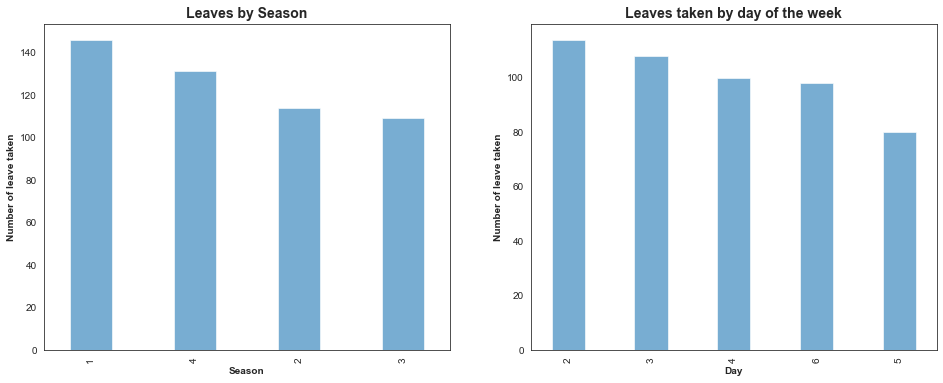


```python
fig = plt.figure(figsize=(16,10))
plt.subplot(321)
plt.hist(data['Transportation expense'], bins = 4,color='red',alpha=0.7)
plt.title('Transportation Expense Distribution',fontsize=12,weight='bold')
plt.grid(True)
plt.subplot(322)
plt.hist(data['Distance from Residence to Work'], bins = 4,alpha=0.6)
plt.title('Distance from Residence to Work Distribution',fontsize=12,weight='bold')
plt.grid(True)
plt.subplot(323)
plt.hist(data['Work load Average per day'], bins = 4,color='red',alpha=0.7)
plt.title('Work Load Avg/Day Expense Distribution',fontsize=12,weight='bold')
plt.grid(True)
plt.subplot(324)
plt.hist(data['Hit target'], bins = 3,alpha=0.6)
plt.title('Hit Target Distribution',fontsize=12,weight='bold')
plt.grid(True)
plt.subplot(325)
plt.hist(data['Body mass index'], bins = 3,color='red',alpha=0.7)
plt.title('BMI Distribution',fontsize=12,weight='bold')
plt.grid(True)
plt.subplot(326)
plt.hist(data['Absent'], bins = 3,alpha=0.6)
plt.title('Absenteeism Distribution',fontsize=12,weight='bold')
plt.grid(True)
plt.savefig("Distribution.png")
```


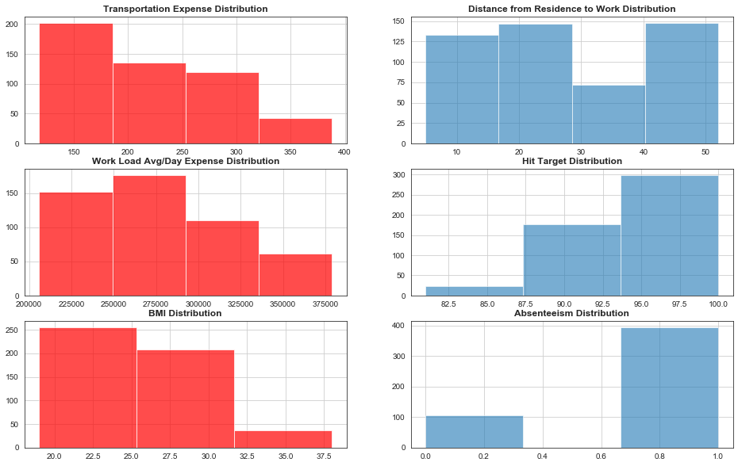


**Como não possuimos valores nulos, não é necessário aplicar imputation**

### OutLier Analysis


```python
def box_plot(x):
    plt.boxplot(data[x])
    plt.xlabel(x,fontsize= 15)
    plt.ylabel('Values',fontsize= 15)
    plt.xticks(fontsize=10, rotation=90)
    plt.yticks(fontsize=10)
    plt.title("Boxplot for {X}".format(X=x),fontsize = 20)
    plt.savefig("Boxplot for {X}.png".format(X=x))
    plt.show()
```


```python
box_plot('Transportation expense')
```


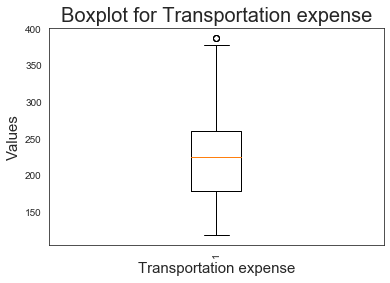


```python
box_plot('Work load Average per day')
```


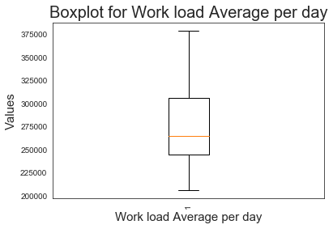


```python
plt.boxplot([ data['Distance from Residence to Work'], data['Service time'], data['Age'], data['Hit target'], data['Body mass index']])
plt.xlabel(['1. Distance from Residence to Work', '2. Service time', '3. Age', '4. Hit target', '5. Body mass index'])
plt.title("BoxPlot of rest of the Variables")
plt.ylabel('Values')
plt.savefig('Boxplot for other variables')
```


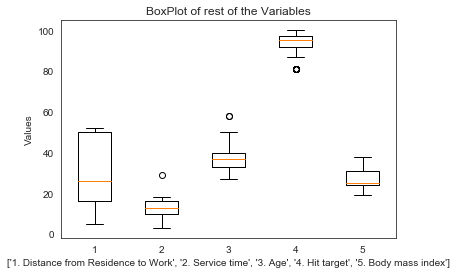


```python
# From the above boxplot we can conclude that in variables 'Distance from Residence to Work' and 'Body mass index'
# there are no outliers
```


```python
# list of variables which doesn't have outlier
toIgnore = ['Distance from Residence to Work', 'Body mass index', 'Work load Average per day']
```


```python


# Looping for all continuou variables to detect and impute Outliers
for i in con:
    # Avoiding the variables which doesn't have outlier
    if i in toIgnore:
        continue
    # Getting 75 and 25 percentile of variable "i"
    q75, q25 = np.percentile(data[i], [75,25])
    # Calculating Interquartile range
    iqr = q75 - q25
    
    # Calculating upper extream and lower extream
    minimum = q25 - (iqr*1.5)
    maximum = q75 + (iqr*1.5)
    
    # Replacing all the outliers value to NA
    data.loc[data[i]< minimum,i] = np.nan
    data.loc[data[i]> maximum,i] = np.nan


# Imputing missing values with mode
data = data.fillna(data.mode().iloc[0])
# Checking if there is any missing value
data.isnull().sum().sum()
```


    0


### Feature Scaling


```python
# Checking the distribution of values for variables in data
for i in con:
    if i == 'Absent':
        continue
    sns.distplot(data[i],bins = 'auto')
    plt.title("Checking Distribution for Variable "+str(i))
    plt.ylabel("Density")
    plt.savefig('{i}_Vs_Density.png'.format(i=i))
    plt.show()
```


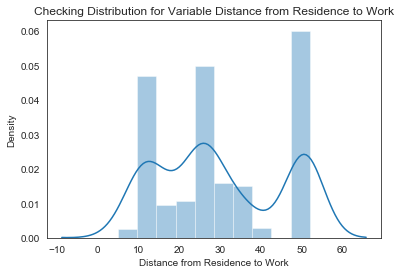


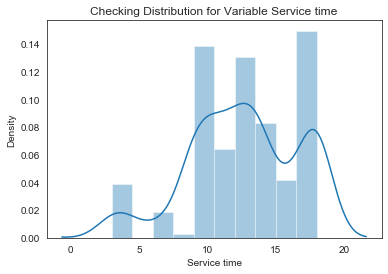


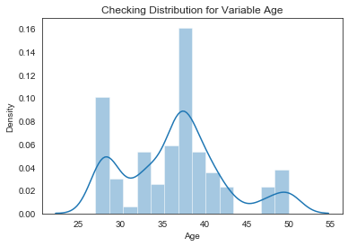


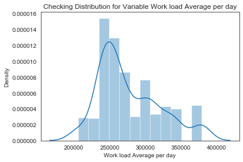


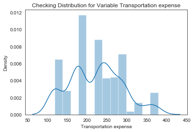


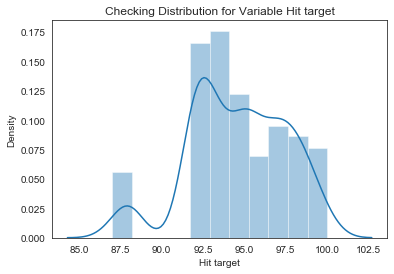


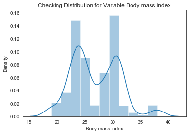


```python
# Since our data is not normally distributed, we will use Normalization for Feature Scalling
# #Normalization
for i in con:
    if i == 'Absent':
        continue
    data[i] = (data[i] - data[i].min())/(data[i].max()-data[i].min())
```


```python
# Since our data is not normally distributed, we will use Normalization for Feature Scalling for test
# #Normalization
for i in con:
    if i == 'Absent':
        continue
    data_test[i] = (data_test[i] - data_test[i].min())/(data_test[i].max()-data_test[i].min())
```


```python
# Checking the distribution of values for variables in data again
for i in con:
    if i == 'Absent':
        continue
    sns.distplot(data[i],bins = 'auto')
    plt.title("Checking Distribution for Variable "+str(i))
    plt.ylabel("Density")
    plt.savefig('{i}_Vs_Density.png'.format(i=i))
    plt.show()
```


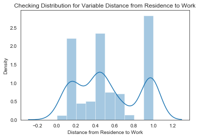


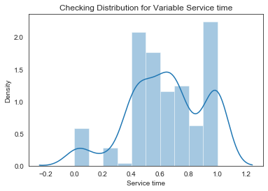


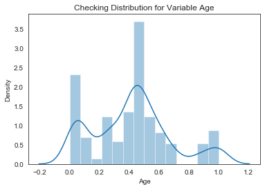


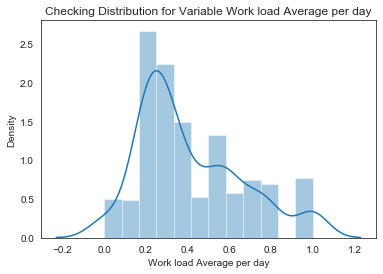


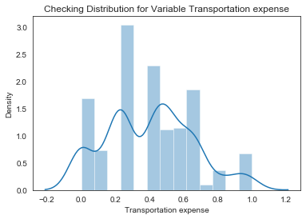


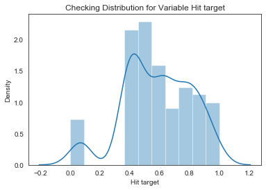


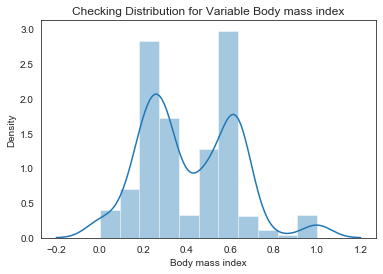


# Machine Learning

## Spliting Data


```python
# Using train_test_split sampling function for splitting data into  test and train samples
from sklearn.model_selection import train_test_split
X_train, X_test, y_train, y_test = train_test_split( data.iloc[:, data.columns != 'Absent'], 
                         data.iloc[:, data.columns == 'Absent'], test_size = 0.30,random_state=109)
```


```python
X_test
```


<div>
<style scoped>
    .dataframe tbody tr th:only-of-type {
        vertical-align: middle;
    }

    .dataframe tbody tr th {
        vertical-align: top;
    }

    .dataframe thead th {
        text-align: right;
    }
</style>
<table border="1" class="dataframe">
  <thead>
    <tr style="text-align: right;">
      <th></th>
      <th>Reason for absence</th>
      <th>Month of absence</th>
      <th>Day of the week</th>
      <th>Seasons</th>
      <th>Transportation expense</th>
      <th>Distance from Residence to Work</th>
      <th>Service time</th>
      <th>Age</th>
      <th>Work load Average per day</th>
      <th>Hit target</th>
      <th>Disciplinary failure</th>
      <th>Education</th>
      <th>Son</th>
      <th>Social drinker</th>
      <th>Social smoker</th>
      <th>Pet</th>
      <th>Body mass index</th>
    </tr>
  </thead>
  <tbody>
    <tr>
      <th>45</th>
      <td>23</td>
      <td>9</td>
      <td>2</td>
      <td>1</td>
      <td>0.000000</td>
      <td>0.106383</td>
      <td>0.466667</td>
      <td>0.434783</td>
      <td>0.205583</td>
      <td>0.384615</td>
      <td>0</td>
      <td>1</td>
      <td>0</td>
      <td>0</td>
      <td>0</td>
      <td>0</td>
      <td>0.473684</td>
    </tr>
    <tr>
      <th>259</th>
      <td>23</td>
      <td>8</td>
      <td>3</td>
      <td>1</td>
      <td>0.657692</td>
      <td>0.659574</td>
      <td>0.666667</td>
      <td>0.260870</td>
      <td>0.345141</td>
      <td>0.538462</td>
      <td>0</td>
      <td>1</td>
      <td>2</td>
      <td>1</td>
      <td>0</td>
      <td>1</td>
      <td>0.578947</td>
    </tr>
    <tr>
      <th>284</th>
      <td>28</td>
      <td>9</td>
      <td>5</td>
      <td>4</td>
      <td>0.000000</td>
      <td>0.170213</td>
      <td>1.000000</td>
      <td>1.000000</td>
      <td>0.510502</td>
      <td>0.384615</td>
      <td>0</td>
      <td>1</td>
      <td>1</td>
      <td>1</td>
      <td>0</td>
      <td>0</td>
      <td>0.631579</td>
    </tr>
    <tr>
      <th>496</th>
      <td>28</td>
      <td>9</td>
      <td>3</td>
      <td>1</td>
      <td>0.492308</td>
      <td>0.425532</td>
      <td>0.866667</td>
      <td>0.608696</td>
      <td>0.322830</td>
      <td>0.000000</td>
      <td>0</td>
      <td>1</td>
      <td>0</td>
      <td>1</td>
      <td>0</td>
      <td>0</td>
      <td>0.210526</td>
    </tr>
    <tr>
      <th>224</th>
      <td>10</td>
      <td>6</td>
      <td>6</td>
      <td>3</td>
      <td>0.492308</td>
      <td>0.425532</td>
      <td>0.866667</td>
      <td>0.608696</td>
      <td>0.992288</td>
      <td>0.538462</td>
      <td>0</td>
      <td>1</td>
      <td>0</td>
      <td>1</td>
      <td>0</td>
      <td>0</td>
      <td>0.210526</td>
    </tr>
    <tr>
      <th>198</th>
      <td>19</td>
      <td>4</td>
      <td>3</td>
      <td>3</td>
      <td>0.657692</td>
      <td>0.659574</td>
      <td>0.666667</td>
      <td>0.260870</td>
      <td>0.696867</td>
      <td>0.692308</td>
      <td>0</td>
      <td>1</td>
      <td>2</td>
      <td>1</td>
      <td>0</td>
      <td>1</td>
      <td>0.578947</td>
    </tr>
    <tr>
      <th>220</th>
      <td>19</td>
      <td>6</td>
      <td>2</td>
      <td>3</td>
      <td>0.492308</td>
      <td>0.425532</td>
      <td>0.866667</td>
      <td>0.608696</td>
      <td>0.992288</td>
      <td>0.538462</td>
      <td>0</td>
      <td>1</td>
      <td>0</td>
      <td>1</td>
      <td>0</td>
      <td>0</td>
      <td>0.210526</td>
    </tr>
    <tr>
      <th>357</th>
      <td>19</td>
      <td>12</td>
      <td>2</td>
      <td>2</td>
      <td>0.657692</td>
      <td>0.659574</td>
      <td>0.666667</td>
      <td>0.260870</td>
      <td>0.177560</td>
      <td>0.461538</td>
      <td>0</td>
      <td>1</td>
      <td>2</td>
      <td>1</td>
      <td>0</td>
      <td>1</td>
      <td>0.578947</td>
    </tr>
    <tr>
      <th>402</th>
      <td>23</td>
      <td>3</td>
      <td>6</td>
      <td>3</td>
      <td>0.000000</td>
      <td>0.170213</td>
      <td>1.000000</td>
      <td>1.000000</td>
      <td>0.222412</td>
      <td>0.846154</td>
      <td>0</td>
      <td>1</td>
      <td>1</td>
      <td>1</td>
      <td>0</td>
      <td>0</td>
      <td>0.631579</td>
    </tr>
    <tr>
      <th>467</th>
      <td>28</td>
      <td>7</td>
      <td>3</td>
      <td>1</td>
      <td>0.000000</td>
      <td>0.106383</td>
      <td>0.466667</td>
      <td>0.434783</td>
      <td>0.140911</td>
      <td>0.384615</td>
      <td>0</td>
      <td>1</td>
      <td>0</td>
      <td>0</td>
      <td>0</td>
      <td>0</td>
      <td>0.473684</td>
    </tr>
    <tr>
      <th>242</th>
      <td>25</td>
      <td>7</td>
      <td>6</td>
      <td>1</td>
      <td>0.142308</td>
      <td>0.148936</td>
      <td>0.733333</td>
      <td>0.304348</td>
      <td>0.401204</td>
      <td>0.846154</td>
      <td>0</td>
      <td>1</td>
      <td>2</td>
      <td>1</td>
      <td>0</td>
      <td>0</td>
      <td>0.315789</td>
    </tr>
    <tr>
      <th>28</th>
      <td>18</td>
      <td>8</td>
      <td>4</td>
      <td>1</td>
      <td>0.657692</td>
      <td>0.659574</td>
      <td>0.666667</td>
      <td>0.260870</td>
      <td>0.000000</td>
      <td>0.384615</td>
      <td>0</td>
      <td>1</td>
      <td>2</td>
      <td>1</td>
      <td>0</td>
      <td>1</td>
      <td>0.578947</td>
    </tr>
    <tr>
      <th>108</th>
      <td>23</td>
      <td>12</td>
      <td>3</td>
      <td>4</td>
      <td>0.411538</td>
      <td>0.446809</td>
      <td>0.400000</td>
      <td>0.043478</td>
      <td>0.320229</td>
      <td>0.769231</td>
      <td>0</td>
      <td>1</td>
      <td>1</td>
      <td>0</td>
      <td>0</td>
      <td>2</td>
      <td>0.263158</td>
    </tr>
    <tr>
      <th>107</th>
      <td>28</td>
      <td>12</td>
      <td>6</td>
      <td>4</td>
      <td>0.546154</td>
      <td>0.957447</td>
      <td>0.533333</td>
      <td>0.391304</td>
      <td>0.320229</td>
      <td>0.769231</td>
      <td>0</td>
      <td>1</td>
      <td>4</td>
      <td>1</td>
      <td>0</td>
      <td>0</td>
      <td>0.210526</td>
    </tr>
    <tr>
      <th>55</th>
      <td>0</td>
      <td>9</td>
      <td>3</td>
      <td>4</td>
      <td>0.000000</td>
      <td>0.170213</td>
      <td>1.000000</td>
      <td>1.000000</td>
      <td>0.205583</td>
      <td>0.384615</td>
      <td>1</td>
      <td>1</td>
      <td>1</td>
      <td>1</td>
      <td>0</td>
      <td>0</td>
      <td>0.631579</td>
    </tr>
    <tr>
      <th>281</th>
      <td>28</td>
      <td>9</td>
      <td>6</td>
      <td>1</td>
      <td>0.665385</td>
      <td>0.553191</td>
      <td>0.600000</td>
      <td>0.565217</td>
      <td>0.510502</td>
      <td>0.384615</td>
      <td>0</td>
      <td>1</td>
      <td>1</td>
      <td>1</td>
      <td>0</td>
      <td>1</td>
      <td>0.315789</td>
    </tr>
    <tr>
      <th>69</th>
      <td>23</td>
      <td>10</td>
      <td>4</td>
      <td>4</td>
      <td>0.411538</td>
      <td>0.446809</td>
      <td>0.400000</td>
      <td>0.043478</td>
      <td>0.274896</td>
      <td>0.461538</td>
      <td>0</td>
      <td>1</td>
      <td>1</td>
      <td>0</td>
      <td>0</td>
      <td>2</td>
      <td>0.263158</td>
    </tr>
    <tr>
      <th>460</th>
      <td>23</td>
      <td>7</td>
      <td>5</td>
      <td>1</td>
      <td>0.234615</td>
      <td>0.446809</td>
      <td>0.400000</td>
      <td>0.130435</td>
      <td>0.140911</td>
      <td>0.384615</td>
      <td>0</td>
      <td>3</td>
      <td>0</td>
      <td>0</td>
      <td>0</td>
      <td>0</td>
      <td>0.000000</td>
    </tr>
    <tr>
      <th>492</th>
      <td>28</td>
      <td>8</td>
      <td>3</td>
      <td>1</td>
      <td>0.000000</td>
      <td>0.106383</td>
      <td>0.466667</td>
      <td>0.434783</td>
      <td>0.253690</td>
      <td>0.461538</td>
      <td>0</td>
      <td>1</td>
      <td>0</td>
      <td>0</td>
      <td>0</td>
      <td>0</td>
      <td>0.473684</td>
    </tr>
    <tr>
      <th>49</th>
      <td>14</td>
      <td>9</td>
      <td>2</td>
      <td>4</td>
      <td>0.665385</td>
      <td>0.553191</td>
      <td>0.600000</td>
      <td>0.565217</td>
      <td>0.205583</td>
      <td>0.384615</td>
      <td>0</td>
      <td>1</td>
      <td>1</td>
      <td>1</td>
      <td>0</td>
      <td>1</td>
      <td>0.315789</td>
    </tr>
    <tr>
      <th>266</th>
      <td>23</td>
      <td>8</td>
      <td>5</td>
      <td>1</td>
      <td>0.000000</td>
      <td>0.170213</td>
      <td>1.000000</td>
      <td>1.000000</td>
      <td>0.345141</td>
      <td>0.538462</td>
      <td>0</td>
      <td>1</td>
      <td>1</td>
      <td>1</td>
      <td>0</td>
      <td>0</td>
      <td>0.631579</td>
    </tr>
    <tr>
      <th>16</th>
      <td>23</td>
      <td>7</td>
      <td>6</td>
      <td>1</td>
      <td>0.234615</td>
      <td>0.978723</td>
      <td>1.000000</td>
      <td>0.478261</td>
      <td>0.194471</td>
      <td>0.769231</td>
      <td>0</td>
      <td>1</td>
      <td>0</td>
      <td>1</td>
      <td>0</td>
      <td>0</td>
      <td>0.631579</td>
    </tr>
    <tr>
      <th>215</th>
      <td>0</td>
      <td>5</td>
      <td>4</td>
      <td>3</td>
      <td>1.000000</td>
      <td>0.936170</td>
      <td>0.533333</td>
      <td>0.391304</td>
      <td>1.000000</td>
      <td>0.384615</td>
      <td>1</td>
      <td>1</td>
      <td>2</td>
      <td>0</td>
      <td>1</td>
      <td>4</td>
      <td>0.105263</td>
    </tr>
    <tr>
      <th>47</th>
      <td>23</td>
      <td>9</td>
      <td>5</td>
      <td>1</td>
      <td>0.665385</td>
      <td>0.553191</td>
      <td>0.600000</td>
      <td>0.565217</td>
      <td>0.205583</td>
      <td>0.384615</td>
      <td>0</td>
      <td>1</td>
      <td>1</td>
      <td>1</td>
      <td>0</td>
      <td>1</td>
      <td>0.315789</td>
    </tr>
    <tr>
      <th>454</th>
      <td>23</td>
      <td>6</td>
      <td>4</td>
      <td>1</td>
      <td>0.000000</td>
      <td>0.170213</td>
      <td>1.000000</td>
      <td>1.000000</td>
      <td>0.277741</td>
      <td>0.615385</td>
      <td>0</td>
      <td>1</td>
      <td>1</td>
      <td>1</td>
      <td>0</td>
      <td>0</td>
      <td>0.631579</td>
    </tr>
    <tr>
      <th>493</th>
      <td>28</td>
      <td>8</td>
      <td>5</td>
      <td>1</td>
      <td>0.665385</td>
      <td>0.553191</td>
      <td>0.600000</td>
      <td>0.565217</td>
      <td>0.253690</td>
      <td>0.461538</td>
      <td>0</td>
      <td>1</td>
      <td>1</td>
      <td>1</td>
      <td>0</td>
      <td>1</td>
      <td>0.315789</td>
    </tr>
    <tr>
      <th>142</th>
      <td>28</td>
      <td>2</td>
      <td>6</td>
      <td>2</td>
      <td>0.546154</td>
      <td>0.957447</td>
      <td>0.533333</td>
      <td>0.391304</td>
      <td>0.558881</td>
      <td>0.923077</td>
      <td>0</td>
      <td>1</td>
      <td>4</td>
      <td>1</td>
      <td>0</td>
      <td>0</td>
      <td>0.210526</td>
    </tr>
    <tr>
      <th>453</th>
      <td>23</td>
      <td>6</td>
      <td>4</td>
      <td>1</td>
      <td>0.411538</td>
      <td>0.446809</td>
      <td>0.400000</td>
      <td>0.043478</td>
      <td>0.277741</td>
      <td>0.615385</td>
      <td>0</td>
      <td>1</td>
      <td>1</td>
      <td>0</td>
      <td>0</td>
      <td>2</td>
      <td>0.263158</td>
    </tr>
    <tr>
      <th>340</th>
      <td>28</td>
      <td>12</td>
      <td>2</td>
      <td>4</td>
      <td>0.234615</td>
      <td>0.978723</td>
      <td>1.000000</td>
      <td>0.478261</td>
      <td>0.177560</td>
      <td>0.461538</td>
      <td>0</td>
      <td>1</td>
      <td>0</td>
      <td>1</td>
      <td>0</td>
      <td>0</td>
      <td>0.631579</td>
    </tr>
    <tr>
      <th>379</th>
      <td>27</td>
      <td>2</td>
      <td>6</td>
      <td>2</td>
      <td>0.234615</td>
      <td>0.978723</td>
      <td>1.000000</td>
      <td>0.478261</td>
      <td>0.265374</td>
      <td>0.692308</td>
      <td>0</td>
      <td>1</td>
      <td>0</td>
      <td>1</td>
      <td>0</td>
      <td>0</td>
      <td>0.631579</td>
    </tr>
    <tr>
      <th>...</th>
      <td>...</td>
      <td>...</td>
      <td>...</td>
      <td>...</td>
      <td>...</td>
      <td>...</td>
      <td>...</td>
      <td>...</td>
      <td>...</td>
      <td>...</td>
      <td>...</td>
      <td>...</td>
      <td>...</td>
      <td>...</td>
      <td>...</td>
      <td>...</td>
      <td>...</td>
    </tr>
    <tr>
      <th>414</th>
      <td>26</td>
      <td>4</td>
      <td>6</td>
      <td>3</td>
      <td>0.815385</td>
      <td>0.234043</td>
      <td>0.066667</td>
      <td>0.043478</td>
      <td>0.193632</td>
      <td>0.846154</td>
      <td>0</td>
      <td>2</td>
      <td>0</td>
      <td>0</td>
      <td>0</td>
      <td>0</td>
      <td>0.315789</td>
    </tr>
    <tr>
      <th>200</th>
      <td>19</td>
      <td>4</td>
      <td>4</td>
      <td>3</td>
      <td>1.000000</td>
      <td>0.936170</td>
      <td>0.533333</td>
      <td>0.391304</td>
      <td>0.696867</td>
      <td>0.692308</td>
      <td>0</td>
      <td>1</td>
      <td>2</td>
      <td>0</td>
      <td>1</td>
      <td>4</td>
      <td>0.105263</td>
    </tr>
    <tr>
      <th>214</th>
      <td>0</td>
      <td>5</td>
      <td>4</td>
      <td>3</td>
      <td>0.815385</td>
      <td>0.234043</td>
      <td>0.066667</td>
      <td>0.043478</td>
      <td>1.000000</td>
      <td>0.384615</td>
      <td>1</td>
      <td>2</td>
      <td>0</td>
      <td>0</td>
      <td>0</td>
      <td>0</td>
      <td>0.315789</td>
    </tr>
    <tr>
      <th>140</th>
      <td>28</td>
      <td>2</td>
      <td>5</td>
      <td>2</td>
      <td>0.142308</td>
      <td>0.148936</td>
      <td>0.733333</td>
      <td>0.304348</td>
      <td>0.558881</td>
      <td>0.923077</td>
      <td>0</td>
      <td>1</td>
      <td>2</td>
      <td>1</td>
      <td>0</td>
      <td>0</td>
      <td>0.315789</td>
    </tr>
    <tr>
      <th>339</th>
      <td>12</td>
      <td>12</td>
      <td>2</td>
      <td>4</td>
      <td>0.411538</td>
      <td>0.446809</td>
      <td>0.400000</td>
      <td>0.043478</td>
      <td>0.177560</td>
      <td>0.461538</td>
      <td>0</td>
      <td>1</td>
      <td>1</td>
      <td>0</td>
      <td>0</td>
      <td>2</td>
      <td>0.263158</td>
    </tr>
    <tr>
      <th>400</th>
      <td>0</td>
      <td>3</td>
      <td>4</td>
      <td>2</td>
      <td>0.965385</td>
      <td>0.255319</td>
      <td>0.600000</td>
      <td>0.173913</td>
      <td>0.222412</td>
      <td>0.846154</td>
      <td>1</td>
      <td>1</td>
      <td>3</td>
      <td>1</td>
      <td>0</td>
      <td>0</td>
      <td>0.315789</td>
    </tr>
    <tr>
      <th>117</th>
      <td>27</td>
      <td>1</td>
      <td>4</td>
      <td>2</td>
      <td>0.411538</td>
      <td>0.446809</td>
      <td>0.400000</td>
      <td>0.043478</td>
      <td>0.593616</td>
      <td>0.615385</td>
      <td>0</td>
      <td>1</td>
      <td>1</td>
      <td>0</td>
      <td>0</td>
      <td>2</td>
      <td>0.263158</td>
    </tr>
    <tr>
      <th>326</th>
      <td>18</td>
      <td>11</td>
      <td>4</td>
      <td>4</td>
      <td>0.450000</td>
      <td>0.127660</td>
      <td>0.733333</td>
      <td>0.434783</td>
      <td>0.451612</td>
      <td>0.769231</td>
      <td>0</td>
      <td>3</td>
      <td>1</td>
      <td>0</td>
      <td>0</td>
      <td>1</td>
      <td>0.526316</td>
    </tr>
    <tr>
      <th>66</th>
      <td>23</td>
      <td>10</td>
      <td>6</td>
      <td>4</td>
      <td>0.234615</td>
      <td>0.978723</td>
      <td>1.000000</td>
      <td>0.478261</td>
      <td>0.274896</td>
      <td>0.461538</td>
      <td>0</td>
      <td>1</td>
      <td>0</td>
      <td>1</td>
      <td>0</td>
      <td>0</td>
      <td>0.631579</td>
    </tr>
    <tr>
      <th>99</th>
      <td>19</td>
      <td>12</td>
      <td>3</td>
      <td>4</td>
      <td>0.000000</td>
      <td>0.106383</td>
      <td>0.466667</td>
      <td>0.434783</td>
      <td>0.320229</td>
      <td>0.769231</td>
      <td>0</td>
      <td>1</td>
      <td>0</td>
      <td>0</td>
      <td>0</td>
      <td>0</td>
      <td>0.473684</td>
    </tr>
    <tr>
      <th>8</th>
      <td>19</td>
      <td>7</td>
      <td>2</td>
      <td>1</td>
      <td>0.142308</td>
      <td>0.148936</td>
      <td>0.733333</td>
      <td>0.304348</td>
      <td>0.194471</td>
      <td>0.769231</td>
      <td>0</td>
      <td>1</td>
      <td>2</td>
      <td>1</td>
      <td>0</td>
      <td>0</td>
      <td>0.315789</td>
    </tr>
    <tr>
      <th>189</th>
      <td>28</td>
      <td>4</td>
      <td>6</td>
      <td>3</td>
      <td>0.411538</td>
      <td>0.446809</td>
      <td>0.400000</td>
      <td>0.043478</td>
      <td>0.696867</td>
      <td>0.692308</td>
      <td>0</td>
      <td>1</td>
      <td>1</td>
      <td>0</td>
      <td>0</td>
      <td>2</td>
      <td>0.263158</td>
    </tr>
    <tr>
      <th>369</th>
      <td>28</td>
      <td>2</td>
      <td>3</td>
      <td>2</td>
      <td>0.000000</td>
      <td>0.106383</td>
      <td>0.466667</td>
      <td>0.434783</td>
      <td>0.265374</td>
      <td>0.692308</td>
      <td>0</td>
      <td>1</td>
      <td>0</td>
      <td>0</td>
      <td>0</td>
      <td>0</td>
      <td>0.473684</td>
    </tr>
    <tr>
      <th>155</th>
      <td>28</td>
      <td>3</td>
      <td>3</td>
      <td>2</td>
      <td>0.665385</td>
      <td>0.957447</td>
      <td>0.600000</td>
      <td>0.217391</td>
      <td>0.794001</td>
      <td>0.615385</td>
      <td>0</td>
      <td>1</td>
      <td>0</td>
      <td>1</td>
      <td>0</td>
      <td>0</td>
      <td>0.210526</td>
    </tr>
    <tr>
      <th>349</th>
      <td>25</td>
      <td>12</td>
      <td>3</td>
      <td>4</td>
      <td>0.000000</td>
      <td>0.106383</td>
      <td>0.466667</td>
      <td>0.434783</td>
      <td>0.177560</td>
      <td>0.461538</td>
      <td>0</td>
      <td>1</td>
      <td>0</td>
      <td>0</td>
      <td>0</td>
      <td>0</td>
      <td>0.473684</td>
    </tr>
    <tr>
      <th>150</th>
      <td>25</td>
      <td>2</td>
      <td>5</td>
      <td>2</td>
      <td>0.411538</td>
      <td>0.446809</td>
      <td>0.400000</td>
      <td>0.043478</td>
      <td>0.558881</td>
      <td>0.923077</td>
      <td>0</td>
      <td>1</td>
      <td>1</td>
      <td>0</td>
      <td>0</td>
      <td>2</td>
      <td>0.263158</td>
    </tr>
    <tr>
      <th>429</th>
      <td>28</td>
      <td>5</td>
      <td>4</td>
      <td>3</td>
      <td>0.234615</td>
      <td>0.978723</td>
      <td>1.000000</td>
      <td>0.478261</td>
      <td>0.232166</td>
      <td>0.923077</td>
      <td>0</td>
      <td>1</td>
      <td>0</td>
      <td>1</td>
      <td>0</td>
      <td>0</td>
      <td>0.631579</td>
    </tr>
    <tr>
      <th>263</th>
      <td>13</td>
      <td>8</td>
      <td>5</td>
      <td>1</td>
      <td>0.000000</td>
      <td>0.170213</td>
      <td>1.000000</td>
      <td>1.000000</td>
      <td>0.345141</td>
      <td>0.538462</td>
      <td>0</td>
      <td>1</td>
      <td>1</td>
      <td>1</td>
      <td>0</td>
      <td>0</td>
      <td>0.631579</td>
    </tr>
    <tr>
      <th>358</th>
      <td>23</td>
      <td>1</td>
      <td>4</td>
      <td>2</td>
      <td>0.411538</td>
      <td>0.446809</td>
      <td>0.400000</td>
      <td>0.043478</td>
      <td>0.717732</td>
      <td>1.000000</td>
      <td>0</td>
      <td>1</td>
      <td>1</td>
      <td>0</td>
      <td>0</td>
      <td>2</td>
      <td>0.263158</td>
    </tr>
    <tr>
      <th>430</th>
      <td>23</td>
      <td>5</td>
      <td>5</td>
      <td>3</td>
      <td>0.934615</td>
      <td>1.000000</td>
      <td>0.000000</td>
      <td>0.043478</td>
      <td>0.232166</td>
      <td>0.923077</td>
      <td>0</td>
      <td>1</td>
      <td>1</td>
      <td>1</td>
      <td>0</td>
      <td>4</td>
      <td>0.421053</td>
    </tr>
    <tr>
      <th>288</th>
      <td>13</td>
      <td>9</td>
      <td>2</td>
      <td>4</td>
      <td>0.234615</td>
      <td>0.978723</td>
      <td>1.000000</td>
      <td>0.478261</td>
      <td>0.510502</td>
      <td>0.384615</td>
      <td>0</td>
      <td>1</td>
      <td>0</td>
      <td>1</td>
      <td>0</td>
      <td>0</td>
      <td>0.631579</td>
    </tr>
    <tr>
      <th>193</th>
      <td>23</td>
      <td>4</td>
      <td>6</td>
      <td>3</td>
      <td>0.665385</td>
      <td>0.553191</td>
      <td>0.600000</td>
      <td>0.565217</td>
      <td>0.696867</td>
      <td>0.692308</td>
      <td>0</td>
      <td>1</td>
      <td>1</td>
      <td>1</td>
      <td>0</td>
      <td>1</td>
      <td>0.315789</td>
    </tr>
    <tr>
      <th>183</th>
      <td>28</td>
      <td>3</td>
      <td>2</td>
      <td>3</td>
      <td>0.411538</td>
      <td>0.446809</td>
      <td>0.400000</td>
      <td>0.043478</td>
      <td>0.794001</td>
      <td>0.615385</td>
      <td>0</td>
      <td>1</td>
      <td>1</td>
      <td>0</td>
      <td>0</td>
      <td>2</td>
      <td>0.263158</td>
    </tr>
    <tr>
      <th>417</th>
      <td>23</td>
      <td>4</td>
      <td>4</td>
      <td>3</td>
      <td>0.815385</td>
      <td>0.234043</td>
      <td>0.066667</td>
      <td>0.043478</td>
      <td>0.193632</td>
      <td>0.846154</td>
      <td>0</td>
      <td>2</td>
      <td>0</td>
      <td>0</td>
      <td>0</td>
      <td>0</td>
      <td>0.315789</td>
    </tr>
    <tr>
      <th>462</th>
      <td>13</td>
      <td>7</td>
      <td>6</td>
      <td>1</td>
      <td>0.546154</td>
      <td>0.957447</td>
      <td>0.533333</td>
      <td>0.391304</td>
      <td>0.140911</td>
      <td>0.384615</td>
      <td>0</td>
      <td>1</td>
      <td>4</td>
      <td>1</td>
      <td>0</td>
      <td>0</td>
      <td>0.210526</td>
    </tr>
    <tr>
      <th>486</th>
      <td>28</td>
      <td>8</td>
      <td>5</td>
      <td>1</td>
      <td>0.665385</td>
      <td>0.553191</td>
      <td>0.600000</td>
      <td>0.565217</td>
      <td>0.253690</td>
      <td>0.461538</td>
      <td>0</td>
      <td>1</td>
      <td>1</td>
      <td>1</td>
      <td>0</td>
      <td>1</td>
      <td>0.315789</td>
    </tr>
    <tr>
      <th>269</th>
      <td>6</td>
      <td>8</td>
      <td>4</td>
      <td>1</td>
      <td>0.253846</td>
      <td>0.787234</td>
      <td>0.266667</td>
      <td>0.000000</td>
      <td>0.345141</td>
      <td>0.538462</td>
      <td>0</td>
      <td>1</td>
      <td>0</td>
      <td>0</td>
      <td>0</td>
      <td>0</td>
      <td>0.105263</td>
    </tr>
    <tr>
      <th>147</th>
      <td>23</td>
      <td>2</td>
      <td>3</td>
      <td>2</td>
      <td>0.411538</td>
      <td>0.446809</td>
      <td>0.400000</td>
      <td>0.043478</td>
      <td>0.558881</td>
      <td>0.923077</td>
      <td>0</td>
      <td>1</td>
      <td>1</td>
      <td>0</td>
      <td>0</td>
      <td>2</td>
      <td>0.263158</td>
    </tr>
    <tr>
      <th>435</th>
      <td>25</td>
      <td>5</td>
      <td>4</td>
      <td>3</td>
      <td>0.411538</td>
      <td>0.446809</td>
      <td>0.400000</td>
      <td>0.043478</td>
      <td>0.232166</td>
      <td>0.923077</td>
      <td>0</td>
      <td>1</td>
      <td>1</td>
      <td>0</td>
      <td>0</td>
      <td>2</td>
      <td>0.263158</td>
    </tr>
    <tr>
      <th>204</th>
      <td>13</td>
      <td>5</td>
      <td>4</td>
      <td>3</td>
      <td>0.657692</td>
      <td>0.659574</td>
      <td>0.666667</td>
      <td>0.260870</td>
      <td>1.000000</td>
      <td>0.384615</td>
      <td>0</td>
      <td>1</td>
      <td>2</td>
      <td>1</td>
      <td>0</td>
      <td>1</td>
      <td>0.578947</td>
    </tr>
  </tbody>
</table>
<p>150 rows × 17 columns</p>
</div>


## Support Vector Machines


```python
# Importing libraries for Linear Regression
#from sklearn.linear_model import LinearRegression
#print("--------------------using GridSearchCV  -------------------------------------------")
#from sklearn.model_selection import GridSearchCV 
#param_grid = {'C': [0.1, 1, 10, 100, 1000],  
#             'gamma': [1, 0.1, 0.01, 0.001, 0.0001], 
#              'kernel': ['rbf']}  
#grid = GridSearchCV(SVC(), param_grid, refit = True, verbose = 3)
#grid.fit(X_train, y_train) 
#grid_predictions = grid.predict(X_test) 
#score_Grid=metrics.accuracy_score(y_test, grid_predictions)
#print("Accuracy GRID TEST = "+ str(score_Grid.mean()))


print("--------------------Without k-fold-------------------------------------------")
# Building model on top of training dataset
fit_SVC = SVC(kernel='rbf', C=1, gamma=0.1).fit(X_train , y_train)
#create_grid_plot(fit_SVC, X_train, y_train)
# Calculating RMSE for training data to check for over fitting
pred_train = fit_SVC.predict(X_train)
rmse_for_train = np.sqrt(mean_squared_error(y_train,pred_train))

# Calculating RMSE for test data to check accuracy
pred_test = fit_SVC.predict(X_test) #previsão com split data
pred_test1 = fit_SVC.predict(data_test) #previsão com data set de teste
rmse_for_test =np.sqrt(mean_squared_error(y_test,pred_test))

#Generate file with prediction
f= open("PredictionSVM_Without_K-Fold.txt","w+")
f.write("ID,Absent\n")
i=0
j=501
for pred in pred_test1:
     f.write("%d,%d\n" % (j,pred))
     j=j+1

f.close()

score_train=metrics.accuracy_score(y_train, pred_train)
score_test=metrics.accuracy_score(y_test, pred_test)

print("Root Mean Squared Error For Training data = "+str(rmse_for_train))
print("Root Mean Squared Error For Test data = "+str(rmse_for_test))
print("Accuracy without K-FOLD (train) = "+ str(score_train))
print("Accuracy without K-FOLD (test) = "+ str(score_test))
print(confusion_matrix(y_test,pred_test))
print(classification_report(y_test,pred_test))

print("\n")


print("------------------- With k-fold ----------------------------")

kfold=KFold(n_splits=10,shuffle=True,random_state=np.random.seed(7)) #por pre-definiçao colocamos o 7 como valor
results = cross_val_score(fit_SVC, X_train, y_train, cv=kfold)
results_test = cross_val_predict(fit_SVC, X_test, y_test, cv=kfold)
print("Accuracy (train) with K-FOLD = " + str(results.mean()))
print("Accuracy (test) with K-FOLD = " + str(results_test.mean()))
print(confusion_matrix(y_test,results_test))
print(classification_report(y_test,results_test))


print("------------------- Kfold with GridSearch -------------------------------------------")
param_grid = {'C': [0.1,1, 10, 100], 'gamma': [1,0.1,0.01,0.001]} 
grid = GridSearchCV(SVC(),param_grid,refit=True,verbose=0)
grid.fit(X_train,y_train)
grid_predictions = grid.predict(X_test)
score_test=metrics.accuracy_score(y_test, grid_predictions)

kfold=KFold(n_splits=10,shuffle=True,random_state=np.random.seed(7)) #por pre-definiçao colocamos o 7 como valor
results = cross_val_score(grid, X_train, y_train, cv=kfold)
print("Accuracy (train) with K-FOLD = " + str(results.mean()))
results_test = cross_val_predict(grid, X_test, y_test, cv=kfold)
print("Accuracy (test) with K-FOLD = " + str(results_test.mean()))
print(confusion_matrix(y_test,results_test))
print(classification_report(y_test,results_test))

```

    --------------------Without k-fold-------------------------------------------
    Root Mean Squared Error For Training data = 0.3664501525251617
    Root Mean Squared Error For Test data = 0.32659863237109044
    Accuracy without K-FOLD (train) = 0.8657142857142858
    Accuracy without K-FOLD (test) = 0.8933333333333333
    [[ 12  15]
     [  1 122]]
                  precision    recall  f1-score   support
    
               0       0.92      0.44      0.60        27
               1       0.89      0.99      0.94       123
    
        accuracy                           0.89       150
       macro avg       0.91      0.72      0.77       150
    weighted avg       0.90      0.89      0.88       150
    
    
    
    ------------------- With k-fold ----------------------------
    Accuracy (train) with K-FOLD = 0.8142857142857143
    Accuracy (test) with K-FOLD = 0.9333333333333333
    [[  7  20]
     [  3 120]]
                  precision    recall  f1-score   support
    
               0       0.70      0.26      0.38        27
               1       0.86      0.98      0.91       123
    
        accuracy                           0.85       150
       macro avg       0.78      0.62      0.65       150
    weighted avg       0.83      0.85      0.82       150
    
    ------------------- Kfold with GridSearch -------------------------------------------
    Accuracy (train) with K-FOLD = 0.8371428571428572
    Accuracy (test) with K-FOLD = 0.9133333333333333
    [[ 11  16]
     [  2 121]]
                  precision    recall  f1-score   support
    
               0       0.85      0.41      0.55        27
               1       0.88      0.98      0.93       123
    
        accuracy                           0.88       150
       macro avg       0.86      0.70      0.74       150
    weighted avg       0.88      0.88      0.86       150
    
    

## Gaussian Naive Bayes


```python
from sklearn.naive_bayes import GaussianNB

#Create a Gaussian Classifier
fit_GNB = GaussianNB().fit(X_train , y_train)

pred_train = fit_GNB.predict(X_train)
rmse_for_train = np.sqrt(mean_squared_error(y_train,pred_train))

# Calculating RMSE for test data to check accuracy
pred_test = fit_GNB.predict(X_test) #previsão com split data
pred_test1 = fit_GNB.predict(data_test) #previsão com data set de teste
rmse_for_test =np.sqrt(mean_squared_error(y_test,pred_test))

#Generate file with prediction
f= open("PredictionGNB_Without_K-Fold.txt","w+")
f.write("ID,Absent\n")
i=0
j=501
for pred in pred_test1:
     f.write("%d,%d\n" % (j,pred))
     j=j+1

f.close()

score_train=metrics.accuracy_score(y_train, pred_train)
score_test=metrics.accuracy_score(y_test, pred_test)

print("Root Mean Squared Error For Training data = "+str(rmse_for_train))
print("Root Mean Squared Error For Test data = "+str(rmse_for_test))
print("Accuracy without K-FOLD (train) = "+ str(score_train))
print("Accuracy without K-FOLD (test) = "+ str(score_test))
print(confusion_matrix(y_test,pred_test))
print(classification_report(y_test,pred_test))

print("\n")

print("--------------------With k-fold-------------------------------------------")

kfold=KFold(n_splits=10,shuffle=True,random_state=np.random.seed(7)) #por pre-definiçao colocamos o 7 como valor
results = cross_val_score(fit_GNB, X_train, y_train, cv=kfold)
print("Accuracy (train) with K-FOLD = " + str(results.mean()))
results_test = cross_val_predict(fit_GNB, X_test, y_test, cv=kfold)
print("Accuracy (test) with K-FOLD = " + str(results_test.mean()))
print(confusion_matrix(y_test,results_test))
print(classification_report(y_test,results_test))
```

    Root Mean Squared Error For Training data = 0.40355562548072954
    Root Mean Squared Error For Test data = 0.32659863237109044
    Accuracy without K-FOLD (train) = 0.8371428571428572
    Accuracy without K-FOLD (test) = 0.8933333333333333
    [[ 11  16]
     [  0 123]]
                  precision    recall  f1-score   support
    
               0       1.00      0.41      0.58        27
               1       0.88      1.00      0.94       123
    
        accuracy                           0.89       150
       macro avg       0.94      0.70      0.76       150
    weighted avg       0.91      0.89      0.87       150
    
    
    
    --------------------With k-fold-------------------------------------------
    Accuracy (train) with K-FOLD = 0.8371428571428572
    Accuracy (test) with K-FOLD = 0.9133333333333333
    [[ 11  16]
     [  2 121]]
                  precision    recall  f1-score   support
    
               0       0.85      0.41      0.55        27
               1       0.88      0.98      0.93       123
    
        accuracy                           0.88       150
       macro avg       0.86      0.70      0.74       150
    weighted avg       0.88      0.88      0.86       150
    
    


## Decision tree


```python
# Importing libraries for Decision Tree 
#from sklearn.tree import DecisionTreeRegressor
#from sklearn.metrics import mean_squared_error
print("--------------------Without k-fold-------------------------------------------")
# Building model on top of training dataset
#fit_DT = DecisionTreeRegressor(max_depth = 2).fit(X_train,y_train)
fit_DT = DecisionTreeClassifier(class_weight=None, criterion='gini', max_depth=10,
            max_features=None, max_leaf_nodes=10, min_samples_leaf=7,
            min_samples_split=60, min_weight_fraction_leaf=0.0,
            presort=False, random_state=None, splitter='random').fit(X_train,y_train)

pred_train = fit_DT.predict(X_train)
rmse_for_train = np.sqrt(mean_squared_error(y_train,pred_train))
score_train=metrics.accuracy_score(y_train, pred_train)

# Calculating metrics without k-fold
pred_test = fit_DT.predict(X_test) #previsão com split data
pred_test1 = fit_DT.predict(data_test) #previsão com data set de teste
rmse_for_test =np.sqrt(mean_squared_error(y_test,pred_test))
score_test=metrics.accuracy_score(y_test, pred_test)

#Generate file with prediction
f= open("PredictionDT_Without_K-Fold.txt","w+")
f.write("ID,Absent\n")
i=0
j=501
for pred in pred_test1:
     f.write("%d,%d\n" % (j,pred))
     j=j+1

f.close()


print("Root Mean Squared Error For Training data = "+str(rmse_for_train))
print("Root Mean Squared Error For Test data = "+str(rmse_for_test))
print("R^2 Score(coefficient of determination) = "+str(r2_score(y_test,pred_test)))
print("Accuracy without K-FOLD (train) = "+ str(score_train))
print("Accuracy without K-FOLD (test) = "+ str(score_test))
print(confusion_matrix(y_test,pred_test))
print(classification_report(y_test,pred_test))
print("\n")


print("--------------------With k-fold-------------------------------------------")
# Calculating metrics with k-fold
kfold=KFold(n_splits=10,shuffle=True,random_state=np.random.seed(7)) #por pre-definiçao colocamos o 7 como valor
results = cross_val_score(fit_DT, X_train, y_train, cv=kfold, scoring='accuracy')
print("Accuracy (train) with K-FOLD = " + str(results.mean()))
results_test = cross_val_predict(fit_DT, X_test, y_test, cv=kfold)
print("Accuracy (test) with K-FOLD = " + str(results_test.mean()))
print(confusion_matrix(y_test,results_test))
print(classification_report(y_test,results_test))


print("------------------- Kfold with GridSearch -------------------------------------------")
parameters={'min_samples_split' : [10,30,60,100],'max_depth': [6,9,10,13], 'max_leaf_nodes': [3,9,12], 
            'min_samples_leaf': [3,7,10]}
clf_tree=DecisionTreeClassifier()
clf=GridSearchCV(clf_tree,parameters)
clf.fit(X_train,y_train)

kfold=KFold(n_splits=10,shuffle=True,random_state=np.random.seed(7)) #por pre-definiçao colocamos o 7 como valor
results = cross_val_score(clf, X_train, y_train, cv=kfold)
print("Accuracy (train) with K-FOLD = " + str(results.mean()))
results_test = cross_val_predict(clf, X_test, y_test, cv=kfold)
print("Accuracy (test) with K-FOLD = " + str(results_test.mean()))
print(confusion_matrix(y_test,results_test))
print(classification_report(y_test,results_test))
```

    --------------------Without k-fold-------------------------------------------
    Root Mean Squared Error For Training data = 0.3779644730092272
    Root Mean Squared Error For Test data = 0.33665016461206926
    R^2 Score(coefficient of determination) = 0.23215898825654924
    Accuracy without K-FOLD (train) = 0.8571428571428571
    Accuracy without K-FOLD (test) = 0.8866666666666667
    [[ 13  14]
     [  3 120]]
                  precision    recall  f1-score   support
    
               0       0.81      0.48      0.60        27
               1       0.90      0.98      0.93       123
    
        accuracy                           0.89       150
       macro avg       0.85      0.73      0.77       150
    weighted avg       0.88      0.89      0.87       150
    
    
    
    --------------------With k-fold-------------------------------------------
    Accuracy (train) with K-FOLD = 0.8314285714285715
    Accuracy (test) with K-FOLD = 0.9266666666666666
    [[ 11  16]
     [  0 123]]
                  precision    recall  f1-score   support
    
               0       1.00      0.41      0.58        27
               1       0.88      1.00      0.94       123
    
        accuracy                           0.89       150
       macro avg       0.94      0.70      0.76       150
    weighted avg       0.91      0.89      0.87       150
    
    ------------------- Kfold with GridSearch -------------------------------------------
    Accuracy (train) with K-FOLD = 0.8428571428571429
    Accuracy (test) with K-FOLD = 0.8933333333333333
    [[ 13  14]
     [  3 120]]
                  precision    recall  f1-score   support
    
               0       0.81      0.48      0.60        27
               1       0.90      0.98      0.93       123
    
        accuracy                           0.89       150
       macro avg       0.85      0.73      0.77       150
    weighted avg       0.88      0.89      0.87       150
    
    

## Random Forest


```python
# Importing libraries for Random Forest
#from sklearn.ensemble import RandomForestRegressor
print("--------------------Without k-fold-------------------------------------------")
# Building model on top of training dataset
fit_RF = RandomForestClassifier(n_estimators = 700).fit(X_train,y_train)

# Calculating RMSE for training data to check for over fitting
pred_train = fit_RF.predict(X_train)
rmse_for_train = np.sqrt(mean_squared_error(y_train,pred_train))
score_train=metrics.accuracy_score(y_train, pred_train)

# Calculating RMSE for test data to check accuracy
pred_test = fit_RF.predict(X_test) #previsão com split data
pred_test1 = fit_RF.predict(data_test) #previsão com data set de teste
rmse_for_test =np.sqrt(mean_squared_error(y_test,pred_test))
score_test=metrics.accuracy_score(y_test, pred_test)

#Generate file with prediction
f= open("PredictionRF_Without_K-Fold.txt","w+")
f.write("ID,Absent\n")
i=0
j=501
for pred in pred_test1:
     f.write("%d,%d\n" % (j,pred))
     j=j+1

f.close()

print("Root Mean Squared Error For Training data = "+str(rmse_for_train))
print("Root Mean Squared Error For Test data = "+str(rmse_for_test))
print("R^2 Score(coefficient of determination) = "+str(r2_score(y_test,pred_test)))
print("Accuracy without K-FOLD (train) = "+ str(score_train))
print("Accuracy without K-FOLD (test) = "+ str(score_test))
print(confusion_matrix(y_test,pred_test))
print(classification_report(y_test,pred_test))

print("\n")

print("--------------------With k-fold-------------------------------------------")
 # Calculating metrics with k-fold
kfold=KFold(n_splits=10,shuffle=True,random_state=np.random.seed(7)) #por pre-definiçao colocamos o 7 como valor
results = cross_val_score(fit_RF, X_train, y_train, cv=kfold, scoring='accuracy')
print("Accuracy (train) with K-FOLD = " + str(results.mean()))
results_test = cross_val_predict(fit_RF, X_test, y_test, cv=kfold)
print("Accuracy (test) with K-FOLD = " + str(results_test.mean()))
print(confusion_matrix(y_test,results_test))
print(classification_report(y_test,results_test))
```

    --------------------Without k-fold-------------------------------------------
    Root Mean Squared Error For Training data = 0.09258200997725514
    Root Mean Squared Error For Test data = 0.41633319989322654
    R^2 Score(coefficient of determination) = -0.17434507678410105
    Accuracy without K-FOLD (train) = 0.9914285714285714
    Accuracy without K-FOLD (test) = 0.8266666666666667
    [[ 15  12]
     [ 14 109]]
                  precision    recall  f1-score   support
    
               0       0.52      0.56      0.54        27
               1       0.90      0.89      0.89       123
    
        accuracy                           0.83       150
       macro avg       0.71      0.72      0.71       150
    weighted avg       0.83      0.83      0.83       150
    
    
    
    --------------------With k-fold-------------------------------------------
    Accuracy (train) with K-FOLD = 0.837142857142857
    Accuracy (test) with K-FOLD = 0.8866666666666667
    [[ 14  13]
     [  3 120]]
                  precision    recall  f1-score   support
    
               0       0.82      0.52      0.64        27
               1       0.90      0.98      0.94       123
    
        accuracy                           0.89       150
       macro avg       0.86      0.75      0.79       150
    weighted avg       0.89      0.89      0.88       150
    
    

### Applying PCA


```python
#import library for PCA
from sklearn.decomposition import PCA
pca = PCA() 
X_train_pca = pca.fit_transform(X_train)
X_test_pca = pca.transform(X_test)
data_test_pca = pca.transform(data_test)
```

## Decision Tree


```python
# Importing libraries for Decision Tree 
#from sklearn.tree import DecisionTreeRegressor
#from sklearn.metrics import mean_squared_error
print("--------------------Without k-fold-------------------------------------------")
# Building model on top of training dataset
#fit_DT = DecisionTreeRegressor(max_depth = 2).fit(X_train,y_train)
fit_DT = DecisionTreeClassifier(class_weight=None, criterion='gini', max_depth=10,
            max_features=None, max_leaf_nodes=10, min_samples_leaf=7,
            min_samples_split=60, min_weight_fraction_leaf=0.0,
            presort=False, random_state=None, splitter='random').fit(X_train_pca,y_train);


pred_train = fit_DT.predict(X_train_pca)
rmse_for_train = np.sqrt(mean_squared_error(y_train,pred_train))
score_train=metrics.accuracy_score(y_train, pred_train)

# Calculating metrics without k-fold
pred_test = fit_DT.predict(X_test_pca) #previsão com split data
pred_test1 = fit_DT.predict(data_test_pca) #previsão com data set de teste
rmse_for_test =np.sqrt(mean_squared_error(y_test,pred_test))
score_test=metrics.accuracy_score(y_test, pred_test)

#Generate file with prediction
f= open("PredictionDT_PCA_Without_K-Fold.txt","w+")
f.write("ID,Absent\n")
i=0
j=501
for pred in pred_test1:
     f.write("%d,%d\n" % (j,pred))
     j=j+1

f.close()


print("Root Mean Squared Error For Training data = "+str(rmse_for_train))
print("Root Mean Squared Error For Test data = "+str(rmse_for_test))
print("R^2 Score(coefficient of determination) = "+str(r2_score(y_test,pred_test)))
print("Accuracy without K-FOLD (train) = "+ str(score_train))
print("Accuracy without K-FOLD (test) = "+ str(score_test))
print(confusion_matrix(y_test,pred_test))
print(classification_report(y_test,pred_test))
print("\n")

print("--------------------With k-fold-------------------------------------------")
# Calculating metrics with k-fold
kfold=KFold(n_splits=10,shuffle=True,random_state=np.random.seed(7)) #por pre-definiçao colocamos o 7 como valor
results = cross_val_score(fit_DT, X_train_pca, y_train, cv=kfold, scoring='accuracy')
print("Accuracy (train) with K-FOLD = " + str(results.mean()))
results_test = cross_val_predict(fit_DT, X_test_pca, y_test, cv=kfold)
print("Accuracy (test) with K-FOLD = " + str(results_test.mean()))
print(confusion_matrix(y_test,results_test))
print(classification_report(y_test,results_test))
```

    --------------------Without k-fold-------------------------------------------
    Root Mean Squared Error For Training data = 0.469041575982343
    Root Mean Squared Error For Test data = 0.5163977794943222
    R^2 Score(coefficient of determination) = -0.8066847335140017
    Accuracy without K-FOLD (train) = 0.78
    Accuracy without K-FOLD (test) = 0.7333333333333333
    [[  2  25]
     [ 15 108]]
                  precision    recall  f1-score   support
    
               0       0.12      0.07      0.09        27
               1       0.81      0.88      0.84       123
    
        accuracy                           0.73       150
       macro avg       0.46      0.48      0.47       150
    weighted avg       0.69      0.73      0.71       150
    
    
    
    --------------------With k-fold-------------------------------------------
    Accuracy (train) with K-FOLD = 0.8
    Accuracy (test) with K-FOLD = 0.98
    [[  2  25]
     [  1 122]]
                  precision    recall  f1-score   support
    
               0       0.67      0.07      0.13        27
               1       0.83      0.99      0.90       123
    
        accuracy                           0.83       150
       macro avg       0.75      0.53      0.52       150
    weighted avg       0.80      0.83      0.77       150
    
    

### Random Forest


```python
# Importing libraries for Random Forest
#from sklearn.ensemble import RandomForestRegressor
print("--------------------Without k-fold-------------------------------------------")
# Building model on top of training dataset
fit_RF = RandomForestClassifier(n_estimators = 700).fit(X_train_pca,y_train)

# Calculating RMSE for training data to check for over fitting
pred_train = fit_RF.predict(X_train_pca)
rmse_for_train = np.sqrt(mean_squared_error(y_train,pred_train))
score_train=metrics.accuracy_score(y_train, pred_train)

# Calculating RMSE for test data to check accuracy
pred_test = fit_RF.predict(X_test_pca) #previsão com split data
pred_test1 = fit_RF.predict(data_test_pca) #previsão com data set de teste
rmse_for_test =np.sqrt(mean_squared_error(y_test,pred_test))
score_test=metrics.accuracy_score(y_test, pred_test)

#Generate file with prediction
f= open("PredictionRF_PCA_Without_K-Fold.txt","w+")
f.write("ID,Absent\n")
i=0
j=501
for pred in pred_test1:
     f.write("%d,%d\n" % (j,pred))
     j=j+1

f.close()

print("Root Mean Squared Error For Training data = "+str(rmse_for_train))
print("Root Mean Squared Error For Test data = "+str(rmse_for_test))
print("R^2 Score(coefficient of determination) = "+str(r2_score(y_test,pred_test)))
print("Accuracy without K-FOLD (train) = "+ str(score_train))
print("Accuracy without K-FOLD (test) = "+ str(score_test))
print(confusion_matrix(y_test,pred_test))
print(classification_report(y_test,pred_test))

print("\n")

print("--------------------With k-fold-------------------------------------------")
 # Calculating metrics with k-fold
kfold=KFold(n_splits=10,shuffle=True,random_state=np.random.seed(7)) #por pre-definiçao colocamos o 7 como valor
results = cross_val_score(fit_RF, X_train_pca, y_train, cv=kfold, scoring='accuracy')
print("Accuracy (train) with K-FOLD = " + str(results.mean()))
results_test = cross_val_predict(fit_RF, X_test_pca, y_test, cv=kfold)
print("Accuracy (test) with K-FOLD = " + str(results_test.mean()))
print(confusion_matrix(y_test,results_test))
print(classification_report(y_test,results_test))
```

    --------------------Without k-fold-------------------------------------------
    Root Mean Squared Error For Training data = 0.09258200997725514
    Root Mean Squared Error For Test data = 0.3559026084010437
    R^2 Score(coefficient of determination) = 0.14182475158084917
    Accuracy without K-FOLD (train) = 0.9914285714285714
    Accuracy without K-FOLD (test) = 0.8733333333333333
    [[ 14  13]
     [  6 117]]
                  precision    recall  f1-score   support
    
               0       0.70      0.52      0.60        27
               1       0.90      0.95      0.92       123
    
        accuracy                           0.87       150
       macro avg       0.80      0.73      0.76       150
    weighted avg       0.86      0.87      0.87       150
    
    
    
    --------------------With k-fold-------------------------------------------
    Accuracy (train) with K-FOLD = 0.8285714285714285
    Accuracy (test) with K-FOLD = 0.9066666666666666
    [[ 13  14]
     [  1 122]]
                  precision    recall  f1-score   support
    
               0       0.93      0.48      0.63        27
               1       0.90      0.99      0.94       123
    
        accuracy                           0.90       150
       macro avg       0.91      0.74      0.79       150
    weighted avg       0.90      0.90      0.89       150
    
    


